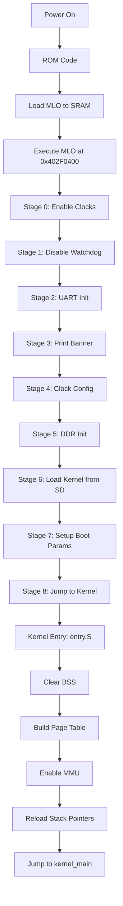

# 01 - Boot and Bring-up

## Overview

Quá trình boot của VinixOS bao gồm 2 giai đoạn chính:
1. **Bootloader (MLO)** - Khởi tạo phần cứng và load kernel từ SD card
2. **Kernel Entry** - Nhận control từ bootloader và khởi động hệ điều hành

Document này giải thích chi tiết cách hệ thống khởi động từ power-on đến khi kernel_main() được gọi.

## Hardware Context

- **Board**: BeagleBone Black
- **SoC**: Texas Instruments AM335x (Cortex-A8, ARMv7-A)
- **Boot Source**: SD Card (MMC0)
- **Memory**: 
  - Internal SRAM: 128KB (0x402F0000)
  - DDR3 RAM: 512MB (0x80000000)

## Boot Flow Diagram




## Phase 1: ROM Boot

AM335x ROM code tự động:
1. Đọc boot configuration pins để xác định boot source (SD card)
2. Load file MLO (bootloader) từ SD card sector đầu tiên vào SRAM
3. Verify GP header (size, load address, checksum)
4. Jump to MLO entry point tại 0x402F0400

**Quan trọng**: ROM code chỉ load tối đa 128KB vào SRAM. Bootloader phải nhỏ gọn.

## Phase 2: Bootloader (MLO)

File: `VinixOS/bootloader/src/main.c`

### Stage 0: Enable Essential Clocks

```c
writel(0x2, CM_PER_L4LS_CLKSTCTRL);  /* Enable L4LS clock */
writel(0x2, CM_PER_L3_CLKSTCTRL);    /* Enable L3 clock */
writel(0x2, CM_PER_L4FW_CLKSTCTRL);  /* Enable L4FW clock */
delay(1000);  /* Allow clocks to stabilize */
```

**Tại sao cần**: Tất cả peripheral (UART, MMC, Timer) đều nằm trên L4 bus. Phải enable clock trước khi access bất kỳ register nào, nếu không sẽ gây Data Abort.

### Stage 1: Disable Watchdog Timer

```c
writel(0xAAAA, WDT1_WSPR);
while (readl(WDT1_WWPS) != 0);
writel(0x5555, WDT1_WSPR);
while (readl(WDT1_WWPS) != 0);
```

**Tại sao cần**: ROM code enable watchdog với timeout ~3 phút. Nếu không disable, hệ thống sẽ tự reset trong quá trình boot.

**Magic sequence**: Watchdog yêu cầu write 0xAAAA rồi 0x5555 vào WSPR register theo thứ tự. Phải đợi WWPS (Write Pending Status) clear giữa 2 lần write.


### Stage 2-3: UART Initialization và Boot Banner

```c
uart_init();
delay(1000000);  /* UART stabilization */

uart_puts("========================================\r\n");
uart_puts("VinixOS Bootloader\r\n");
uart_puts("========================================\r\n");
```

**UART Configuration**:
- Baudrate: 115200
- Format: 8N1 (8 data bits, No parity, 1 stop bit)
- UART0 trên L4_WKUP bus (0x44E09000)

**Delay quan trọng**: UART cần thời gian stabilize sau init. Không có delay sẽ mất ký tự đầu tiên.

### Stage 4: Clock Configuration

```c
clock_init();  /* Configure DDR PLL for 400MHz */
```

**DDR PLL Setup**:
- Input: 24MHz crystal oscillator
- Multiplier: M = 400, Divider: N = 23
- Output: 400MHz cho DDR3 controller

**Lưu ý**: ROM code đã config MPU PLL (CPU clock). Bootloader chỉ cần config DDR PLL.

### Stage 5: DDR3 Initialization

```c
ddr_init();
if (ddr_test() != 0) {
    panic("DDR memory test FAILED!");
}
```

**DDR Configuration**:
- Type: DDR3-800 (400MHz)
- Size: 512MB
- Base Address: 0x80000000
- EMIF Controller: 0x4C000000

**Memory Test**: Write/read pattern test để verify DDR hoạt động đúng trước khi load kernel.


### Stage 6: Load Kernel từ SD Card

```c
#define KERNEL_BASE_ADDR   0x80000000
#define KERNEL_START_SECTOR 2048      /* Offset 1MB trên SD card */
#define KERNEL_SIZE_SECTORS 2048      /* Max 1MB kernel */

mmc_init();
mmc_read_sectors(KERNEL_START_SECTOR, KERNEL_SIZE_SECTORS, 
                (void*)KERNEL_BASE_ADDR);
```

**SD Card Layout**:
```
Sector 0-127:    MLO (bootloader) - 64KB
Sector 128-2047: Reserved
Sector 2048+:    Kernel image (VinixOS.bin)
```

**Kernel Load Address**: 0x80000000 (đầu DDR3). Kernel được link để chạy tại địa chỉ này.

### Stage 7: Boot Parameters

```c
struct boot_params {
    uint32_t reserved;
    uint32_t mem_desc_addr;
    uint8_t  boot_device;    /* 0x08 = MMC0 */
    uint8_t  reset_reason;   /* 0x01 = Power-on reset */
    uint8_t  reserved2;
    uint8_t  reserved3;
};
```

**ARM Boot Protocol**: Truyền thông tin boot cho kernel qua registers:
- r0 = 0
- r1 = Machine Type (0x0E05 = BeagleBone Black)
- r2 = Pointer to boot_params

### Stage 8: Jump to Kernel

```c
/* Verify kernel magic (sanity check) */
uint32_t *magic = (uint32_t *)0x80000000;
uint32_t first = *magic;
bool ok_branch = ((first & 0xFF000000) == 0xEA000000);  /* Branch instruction */
bool ok_ldr_vec = ((first & 0xFFFFF000) == 0xE59FF000); /* LDR pc vector */

if (!ok_branch && !ok_ldr_vec) {
    panic("Invalid kernel image!");
}

/* Jump with ARM boot parameters */
asm volatile(
    "mov r0, #0\n"
    "ldr r1, =0x0E05\n"     /* BeagleBone Black MACH_TYPE */
    "mov r2, %0\n"
    "ldr pc, =0x80000000\n"
    :: "r" (&params)
);
```

**Kernel Magic Check**: Byte đầu tiên của kernel phải là ARM branch instruction hoặc LDR PC vector. Đây là sanity check để tránh boot kernel corrupt.


## Phase 3: Kernel Entry (entry.S)

File: `VinixOS/kernel/src/arch/arm/entry/entry.S`

Kernel entry point chạy tại Physical Address (PA) 0x80000000, MMU vẫn OFF.

### Step 1: Clear BSS Section

```asm
ldr     r0, =_bss_start
sub     r0, r0, #VA_OFFSET_BOOT    /* Convert VA to PA */
ldr     r1, =_bss_end
sub     r1, r1, #VA_OFFSET_BOOT
mov     r2, #0

1:  cmp     r0, r1
    strlo   r2, [r0], #4
    blo     1b
```

**Tại sao cần**: Linker symbols (_bss_start, _bss_end) là Virtual Address (VA) 0xC0xxxxxx, nhưng MMU chưa enable. Phải subtract VA_OFFSET (0x40000000) để có PA.

**BSS Section**: Uninitialized global variables. C standard yêu cầu zero-init trước khi gọi bất kỳ C code nào.

### Step 2: Build Page Table

```asm
ldr     r0, =_pgd_start
sub     r0, r0, #VA_OFFSET_BOOT     /* pgd PA */
bl      mmu_build_page_table_boot
```

Gọi C function `mmu_build_page_table_boot()` để tạo L1 page table. Function này nằm trong section `.text.boot_entry` (VMA == LMA == PA) nên có thể gọi trước khi enable MMU.

**Page Table Setup** (chi tiết trong doc 03-memory-and-mmu.md):
- Identity mapping: PA 0x80000000 → VA 0x80000000 (temporary)
- High mapping: PA 0x80000000 → VA 0xC0000000 (permanent)
- User space: PA 0x80000000 → VA 0x40000000 (permanent)
- Peripherals: Identity mapping (PA == VA)


### Step 3: Enable MMU

```asm
ldr     r0, =_pgd_start
sub     r0, r0, #VA_OFFSET_BOOT     /* pgd PA */
bl      mmu_enable
```

Function `mmu_enable()` thực hiện:
1. Write page table base address vào TTBR0
2. Set Domain Access Control (DACR)
3. Enable MMU bit trong SCTLR
4. Flush TLB và caches

**Sau khi MMU enable**: CPU vẫn đang execute tại PA (qua identity mapping). Cần trampoline để jump sang VA.

### Step 4: Reload Stack Pointers

```asm
cps     #0x11                       /* FIQ mode */
ldr     sp, =_fiq_stack_top

cps     #0x12                       /* IRQ mode */
ldr     sp, =_irq_stack_top

cps     #0x17                       /* ABT mode */
ldr     sp, =_abt_stack_top

cps     #0x1B                       /* UND mode */
ldr     sp, =_und_stack_top

cps     #0x13                       /* SVC mode */
ldr     sp, =_svc_stack_top
```

**Tại sao cần**: Stack pointers được init bởi bootloader tại PA. Sau khi enable MMU, phải reload về VA để tránh stack corruption khi identity mapping bị remove.

**ARMv7-A Exception Modes**: Mỗi mode có SP riêng. Phải switch mode để set từng SP.


### Step 5: Trampoline to High VA

```asm
ldr     pc, =kernel_main
```

**THE TRAMPOLINE**: Instruction này load VA của kernel_main (0xC0xxxxxx) vào PC.

**Cách hoạt động**:
1. `ldr pc, =kernel_main` compile thành `ldr pc, [pc, #offset]`
2. Literal pool chứa địa chỉ 0xC0xxxxxx nằm trong `.text.boot_entry` (accessible qua identity map)
3. CPU load 0xC0xxxxxx vào PC
4. CPU fetch instruction tiếp theo từ VA 0xC0xxxxxx (qua high mapping)
5. Từ đây trở đi, code chạy hoàn toàn tại VA

**Sau trampoline**: Identity mapping vẫn còn active. Sẽ được remove bởi `mmu_init()` trong kernel_main().

## Memory Map Evolution

### At Bootloader Stage
```
Physical Memory:
0x00000000 - 0x402FFFFF: ROM, Internal RAM
0x44E00000 - 0x44E0FFFF: L4_WKUP Peripherals (UART0, CM_PER)
0x48000000 - 0x482FFFFF: L4_PER Peripherals (INTC, Timer)
0x80000000 - 0x9FFFFFFF: DDR3 RAM (512MB)

Virtual Memory: N/A (MMU OFF)
```

### After MMU Enable (entry.S)
```
Virtual Memory:
0x40000000 - 0x40FFFFFF: User Space (16MB) → PA 0x80000000
0x80000000 - 0x87FFFFFF: Identity Map (128MB) → PA 0x80000000 [TEMPORARY]
0xC0000000 - 0xC7FFFFFF: Kernel Space (128MB) → PA 0x80000000
0x44E00000 - 0x44E0FFFF: Peripherals (identity)
0x48000000 - 0x482FFFFF: Peripherals (identity)
```

### After mmu_init() in kernel_main()
```
Virtual Memory:
0x40000000 - 0x40FFFFFF: User Space (16MB) → PA 0x80000000
0xC0000000 - 0xC7FFFFFF: Kernel Space (128MB) → PA 0x80000000
0x44E00000 - 0x44E0FFFF: Peripherals (identity)
0x48000000 - 0x482FFFFF: Peripherals (identity)

Identity mapping REMOVED - VA 0x80000000 now unmapped
```

## Key Takeaways

1. **Two-stage boot**: ROM → MLO → Kernel. Mỗi stage có trách nhiệm riêng.

2. **Hardware init sequence quan trọng**: Clocks → Watchdog → UART → DDR. Sai thứ tự sẽ crash.

3. **MMU trampoline**: Enable MMU với identity + high mapping, sau đó jump sang VA, cuối cùng remove identity mapping.

4. **PA vs VA**: Code phải aware về địa chỉ đang dùng. Trước MMU enable dùng PA, sau đó dùng VA.

5. **Stack reload**: Sau enable MMU phải reload tất cả stack pointers về VA.

6. **Boot verification**: Check kernel magic trước khi jump để tránh execute corrupt data.
