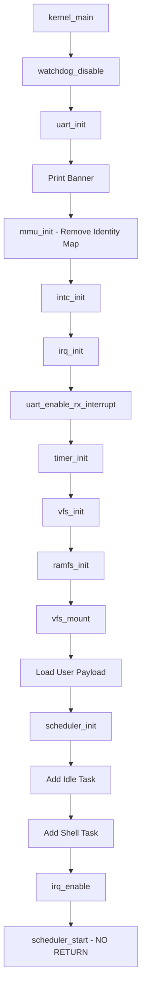

# 02 - Kernel Initialization

## Overview

Sau khi entry.S trampoline sang high VA, kernel_main() được gọi. Document này giải thích quá trình khởi tạo kernel từ kernel_main() đến khi scheduler bắt đầu chạy tasks.

File: `VinixOS/kernel/src/kernel/main.c`

## Initialization Sequence



## Step-by-Step Walkthrough

### 1. Hardware Re-initialization

```c
watchdog_disable();
uart_init();
```

**Tại sao re-init**: Bootloader đã init những thứ này, nhưng kernel không assume bootloader state. Re-init để đảm bảo consistent state.


### 2. MMU Phase B - Remove Identity Mapping

```c
mmu_init();
```

**Mục đích**: Remove temporary identity mapping (VA 0x80000000 → PA 0x80000000) và update VBAR.

**Implementation** (file: `kernel/src/kernel/mmu/mmu.c`):

```c
void mmu_init(void) {
    /* Remove identity mapping */
    for (i = 0; i < BOOT_IDENTITY_MB; i++) {
        pa = BOOT_IDENTITY_PA + (i * MMU_SECTION_SIZE);
        pgd[pa >> MMU_SECTION_SHIFT] = 0;  /* FAULT */
    }
    
    /* Flush TLB */
    __asm__ __volatile__(
        "mov r0, #0\n\t"
        "mcr p15, 0, r0, c8, c7, 0\n\t"  /* TLBIALL */
        "dsb\n\t"
        "isb\n\t"
    );
    
    /* Update VBAR to high VA */
    uint32_t vbar_va = (uint32_t)&_boot_start + VA_OFFSET;
    __asm__ __volatile__(
        "mcr p15, 0, %0, c12, c0, 0\n\t"  /* Write VBAR */
        "isb\n\t"
        :: "r"(vbar_va)
    );
}
```

**Tại sao remove identity mapping**: 
- Giải phóng VA space 0x80000000-0x87FFFFFF
- Bắt lỗi nếu code vô tình dereference PA thay vì VA
- True 3G/1G split: User 0x40000000, Kernel 0xC0000000

**VBAR Update**: Vector table physical location vẫn ở 0x80000000, nhưng VBAR phải point đến VA 0xC0000000 để exception vectors resolve đúng.


### 3. Interrupt Controller Setup

```c
intc_init();
irq_init();
uart_enable_rx_interrupt();
timer_init();
```

**Initialization Order quan trọng**:

1. **intc_init()**: Configure INTC hardware
   - Reset INTC
   - Set priority threshold
   - Enable INTC globally

2. **irq_init()**: Setup IRQ framework
   - Initialize IRQ handler table
   - Register default handlers

3. **uart_enable_rx_interrupt()**: Enable UART RX interrupt
   - Register UART RX handler
   - Enable interrupt tại UART hardware
   - Enable interrupt tại INTC

4. **timer_init()**: Setup timer for scheduler ticks
   - Configure DMTimer2 for 10ms periodic interrupt
   - Register timer handler
   - Enable timer interrupt tại INTC

**Lưu ý**: IRQ vẫn DISABLED tại CPU level (I-bit trong CPSR). Sẽ enable sau khi scheduler setup xong.

### 4. Filesystem Initialization

```c
vfs_init();

if (ramfs_init() != E_OK) {
    uart_printf("[BOOT] ERROR: Failed to initialize RAMFS\n");
    while (1);
}

if (vfs_mount("/", ramfs_get_operations()) != E_OK) {
    uart_printf("[BOOT] ERROR: Failed to mount RAMFS at /\n");
    while (1);
}
```

**VFS Layer**: Virtual File System abstraction cho phép mount nhiều filesystem types.

**RAMFS**: In-memory filesystem. Files được embed vào kernel image lúc build (qua payload.S).

**Mount Point**: "/" - root filesystem. Tất cả file operations sẽ route qua RAMFS.


### 5. Load User Payload

```c
uint32_t payload_size = (uint32_t)&_shell_payload_end - (uint32_t)&_shell_payload_start;
uart_printf("[BOOT] Loading User App Payload to 0x%x (Size: %d bytes)\n", 
            USER_SPACE_VA, payload_size);

uint8_t *src = &_shell_payload_start;
uint8_t *dst = (uint8_t *)USER_SPACE_VA;
for (uint32_t i = 0; i < payload_size; i++) {
    dst[i] = src[i];
}
```

**User Payload**: Shell application binary được embed vào kernel image qua `payload.S`:

```asm
.section .rodata
.global _shell_payload_start
.global _shell_payload_end

_shell_payload_start:
    .incbin "../../userspace/build/shell.bin"
_shell_payload_end:
```

**Load Address**: 0x40000000 (USER_SPACE_VA). Shell được compile và link để chạy tại địa chỉ này.

**Tại sao copy**: Payload nằm trong kernel .rodata (read-only). Copy sang User Space để user code có thể modify data section của nó.

### 6. Scheduler Initialization

```c
scheduler_init();

/* Add Idle Task (Kernel Mode) */
struct task_struct *idle_ptr = get_idle_task();
scheduler_add_task(idle_ptr);

/* Add User Application Task (Shell) */
shell_task.name = "User App (Shell)";
shell_task.state = TASK_STATE_READY;
task_stack_init(&shell_task, (void (*)(void))USER_SPACE_VA,
                (void *)(USER_STACK_BASE - USER_STACK_SIZE),
                USER_STACK_SIZE);
scheduler_add_task(&shell_task);
```

**Idle Task**: Kernel mode task chạy khi không có task nào khác ready. Chỉ loop vô hạn và yield.

**Shell Task**: User mode task. Entry point = 0x40000000, stack = end of User Space (0x40100000 - 4KB).

**task_stack_init()**: Setup initial stack frame để khi context switch lần đầu, task sẽ start execute tại entry point với đúng CPSR (User mode, IRQ enabled).


### 7. Enable IRQ và Start Scheduler

```c
uart_printf("[BOOT] Starting Scheduler...\n");

/* Enable IRQ at CPU level (clear I-bit in CPSR) */
irq_enable();

/* Start scheduler - DOES NOT RETURN */
scheduler_start();

/* Should never reach here */
while (1) {
    uart_printf("PANIC: Scheduler returned!\n");
}
```

**irq_enable()**: Clear I-bit trong CPSR để CPU accept IRQ.

```c
static inline void irq_enable(void) {
    __asm__ volatile("cpsie i" ::: "memory");
}
```

**scheduler_start()**: 
1. Mark first task (Idle) as RUNNING
2. Load task context (registers, SP, SPSR)
3. Jump to task entry point
4. **NEVER RETURNS**

**Từ đây trở đi**: System chạy trong task context. Kernel code chỉ execute trong exception handlers (IRQ, SVC, Abort).

## Initialization Checklist

Trước khi scheduler_start(), phải đảm bảo:

- [x] MMU enabled và configured đúng
- [x] Exception vectors setup (VBAR)
- [x] INTC initialized
- [x] Timer configured cho scheduler ticks
- [x] UART RX interrupt enabled (cho keyboard input)
- [x] VFS mounted
- [x] User payload loaded
- [x] Ít nhất 1 task added vào scheduler
- [x] IRQ enabled tại CPU level

**Thiếu bất kỳ bước nào**: System sẽ crash hoặc hang.

## Key Takeaways

1. **Initialization order matters**: Hardware dependencies phải respect. Ví dụ: INTC trước timer, IRQ framework trước register handlers.

2. **MMU Phase B**: Remove identity mapping để enforce true VA usage và catch bugs.

3. **IRQ enable timing**: Enable IRQ SAU KHI tất cả interrupt infrastructure ready, TRƯỚC KHI start scheduler.

4. **User payload loading**: Copy từ kernel .rodata sang User Space để isolate kernel và user memory.

5. **Scheduler start is one-way**: Sau scheduler_start(), không bao giờ return về kernel_main(). System chạy hoàn toàn trong task context.

6. **No dynamic memory allocation**: Tất cả structures (tasks, stacks) đều static allocation. Đơn giản nhưng đủ cho reference OS.
