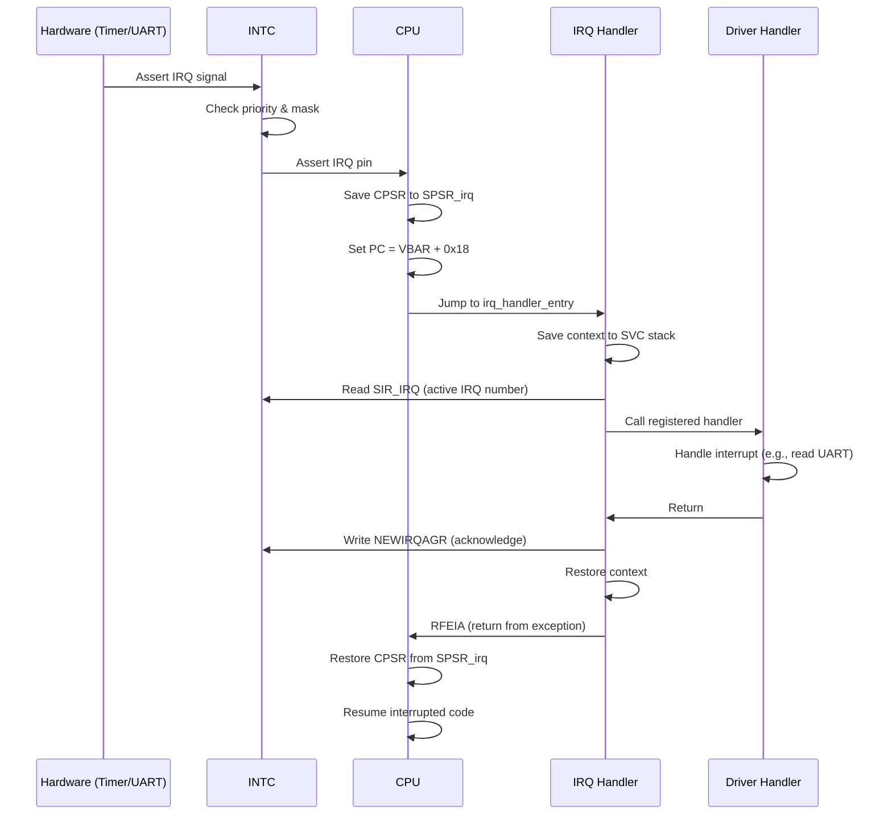

# 04 - Interrupt and Exception Handling

## Overview

VinixOS implement full ARMv7-A exception handling với 7 exception types. Document này giải thích exception mechanism, vector table, INTC configuration, và IRQ flow.

## ARMv7-A Exception Model

### Exception Types

```
Exception       Vector Offset   Mode    Priority
Reset           0x00            SVC     1 (highest)
Undefined       0x04            UND     6
SVC             0x08            SVC     6
Prefetch Abort  0x0C            ABT     5
Data Abort      0x10            ABT     5
Reserved        0x14            -       -
IRQ             0x18            IRQ     4
FIQ             0x1C            FIQ     2
```

**Exception Priority**: Reset > FIQ > IRQ > Abort > Undefined/SVC

**Mode Switch**: Mỗi exception switch CPU sang mode tương ứng với SP và LR riêng.

### Exception Entry Sequence (Hardware)

Khi exception xảy ra, CPU tự động:

1. Save current CPSR vào SPSR_<mode>
2. Switch sang exception mode
3. Disable IRQ (set I-bit)
4. Save return address vào LR_<mode>
5. Set PC = VBAR + vector_offset

**Lưu ý**: CPU KHÔNG save general registers (r0-r12). Exception handler phải save/restore.


## Vector Table

File: `VinixOS/kernel/src/arch/arm/entry/entry.S`

```asm
.section .text.vectors, "ax"
.align 5
.global vector_table

vector_table:
    ldr pc, =reset_handler          /* 0x00: Reset */
    ldr pc, =undefined_handler      /* 0x04: Undefined Instruction */
    ldr pc, =svc_handler_entry      /* 0x08: Supervisor Call */
    ldr pc, =prefetch_abort_handler /* 0x0C: Prefetch Abort */
    ldr pc, =data_abort_handler     /* 0x10: Data Abort */
    nop                             /* 0x14: Reserved */
    ldr pc, =irq_handler_entry      /* 0x18: IRQ */
    ldr pc, =fiq_handler            /* 0x1C: FIQ */
```

**Vector Table Location**:
- Physical: 0x80000000 (đầu kernel image)
- Virtual: 0xC0000000 (sau enable MMU)
- VBAR register point đến 0xC0000000

**LDR PC Pattern**: Load handler address từ literal pool và jump. Cho phép handler ở bất kỳ đâu trong memory.

## Exception Handlers

### 1. Undefined Instruction

```c
void c_undef_handler(void) {
    uint32_t ifsr, ifar;
    asm volatile("mrc p15, 0, %0, c5, c0, 1" : "=r" (ifsr));  /* IFSR */
    asm volatile("mrc p15, 0, %0, c6, c0, 2" : "=r" (ifar));  /* IFAR */
    
    uart_printf("PANIC: UNDEFINED INSTRUCTION!\n");
    uart_printf("IFAR (Fault PC): 0x%08x\n", ifar);
    uart_printf("IFSR (Status):   0x%08x\n", ifsr);
    
    /* Terminate current task */
    struct task_struct *current = scheduler_current_task();
    if (current) {
        scheduler_terminate_task(current->id);
    }
    
    while (1);  /* Halt */
}
```

**Causes**: Execute invalid instruction, thumb/ARM mode mismatch.

**CP15 Registers**:
- IFSR (c5,c0,1): Instruction Fault Status
- IFAR (c6,c0,2): Instruction Fault Address (PC của instruction lỗi)


### 2. Data Abort

```c
void c_data_abort_handler(void) {
    uint32_t dfsr, dfar;
    asm volatile("mrc p15, 0, %0, c5, c0, 0" : "=r" (dfsr));  /* DFSR */
    asm volatile("mrc p15, 0, %0, c6, c0, 0" : "=r" (dfar));  /* DFAR */
    
    uart_printf("PANIC: DATA ABORT!\n");
    uart_printf("DFAR (Fault Address): 0x%08x\n", dfar);
    uart_printf("DFSR (Status): 0x%08x\n", dfsr);
    
    /* Decode fault type */
    uint32_t fs = (dfsr & 0xF) | ((dfsr & 0x400) >> 6);
    if (fs == 0x05 || fs == 0x07) {
        uart_printf("Translation Fault (unmapped VA)\n");
    } else if (fs == 0x0D || fs == 0x0F) {
        uart_printf("Permission Fault (AP violation)\n");
    }
    
    /* Terminate task */
    struct task_struct *current = scheduler_current_task();
    if (current) {
        scheduler_terminate_task(current->id);
    }
    
    while (1);
}
```

**Causes**:
- Translation Fault: Access unmapped VA
- Permission Fault: User mode access kernel memory
- Alignment Fault: Unaligned access (if enabled)

**CP15 Registers**:
- DFSR (c5,c0,0): Data Fault Status
- DFAR (c6,c0,0): Data Fault Address (VA gây lỗi)

### 3. Prefetch Abort

Similar to Data Abort nhưng cho instruction fetch. Xảy ra khi PC point đến invalid VA.

### 4. SVC (System Call)

```asm
svc_handler_entry:
    /* Save User Context */
    sub     lr, lr, #0              /* LR already points to return address */
    srsdb   sp!, #0x13              /* Save LR_svc and SPSR_svc to SVC stack */
    push    {r0-r12, lr}            /* Save registers */
    
    /* Call C handler */
    mov     r0, sp                  /* Pass stack pointer (context) */
    bl      svc_handler
    
    /* Restore User Context */
    pop     {r0-r12, lr}
    rfeia   sp!                     /* Restore SPSR and return */
```

**SVC Context**: Stack frame chứa tất cả registers + SPSR. C handler nhận pointer đến frame này.

**Return**: `rfeia` (Return From Exception, Increment After) restore SPSR vào CPSR và return đến LR.

Chi tiết syscall mechanism trong doc 06-syscall-mechanism.md.


### 5. IRQ (Interrupt Request)

```asm
irq_handler_entry:
    /* Save context */
    sub     lr, lr, #4              /* Adjust return address */
    srsdb   sp!, #0x13              /* Save to SVC stack (not IRQ stack!) */
    cps     #0x13                   /* Switch to SVC mode */
    push    {r0-r12, lr}
    
    /* Call C handler */
    bl      irq_handler
    
    /* Restore context */
    pop     {r0-r12, lr}
    rfeia   sp!
```

**LR Adjustment**: IRQ LR points to instruction AFTER interrupted instruction. Subtract 4 để return đúng.

**Stack Switch**: Save context vào SVC stack (không phải IRQ stack) để context switch có thể work.

**C Handler**:

```c
void irq_handler(void) {
    /* Read active IRQ number from INTC */
    uint32_t irq_num = readl(INTC_SIR_IRQ) & 0x7F;
    
    /* Call registered handler */
    if (irq_handlers[irq_num]) {
        irq_handlers[irq_num]();
    }
    
    /* Acknowledge interrupt */
    writel(0x1, INTC_CONTROL);  /* NEWIRQAGR */
}
```

## Interrupt Controller (INTC)

AM335x INTC là centralized interrupt controller route tất cả peripheral interrupts đến CPU.

### INTC Architecture

```
Peripheral IRQs (128 sources)
    ↓
INTC (Priority, Masking)
    ↓
CPU IRQ/FIQ pins
```

**INTC Features**:
- 128 interrupt sources
- Priority levels (0-127, 0 = highest)
- Per-interrupt enable/disable
- Nested interrupt support


### INTC Initialization

File: `VinixOS/kernel/src/drivers/intc.c`

```c
void intc_init(void) {
    /* Reset INTC */
    writel(0x2, INTC_SYSCONFIG);  /* SOFTRESET */
    while (!(readl(INTC_SYSSTATUS) & 0x1));  /* Wait for reset complete */
    
    /* Disable all interrupts */
    for (int i = 0; i < 4; i++) {
        writel(0xFFFFFFFF, INTC_MIR_SET(i));
    }
    
    /* Set priority threshold to 0xFF (allow all) */
    writel(0xFF, INTC_THRESHOLD);
    
    /* Enable new IRQ/FIQ generation */
    writel(0x1, INTC_CONTROL);  /* NEWIRQAGR */
}
```

**MIR (Mask Interrupt Register)**: 4 registers × 32 bits = 128 interrupt sources. Set bit = mask (disable).

**Priority Threshold**: Chỉ interrupts có priority < threshold mới được forward đến CPU.

### Enable Specific Interrupt

```c
void intc_enable_interrupt(uint32_t irq_num, uint32_t priority) {
    /* Set priority */
    writel(priority, INTC_ILR(irq_num));
    
    /* Unmask interrupt */
    uint32_t reg = irq_num / 32;
    uint32_t bit = irq_num % 32;
    writel(1 << bit, INTC_MIR_CLEAR(reg));
}
```

**ILR (Interrupt Level Register)**: Set priority cho mỗi interrupt source.

**MIR_CLEAR**: Write 1 để unmask (enable) interrupt.

## IRQ Flow Diagram




## IRQ Handler Registration

File: `VinixOS/kernel/src/kernel/irq/irq_core.c`

```c
#define MAX_IRQS 128
static irq_handler_t irq_handlers[MAX_IRQS];

void irq_init(void) {
    for (int i = 0; i < MAX_IRQS; i++) {
        irq_handlers[i] = NULL;
    }
}

int irq_register_handler(uint32_t irq_num, irq_handler_t handler) {
    if (irq_num >= MAX_IRQS) return -1;
    
    irq_handlers[irq_num] = handler;
    return 0;
}
```

**Example**: Timer interrupt registration

```c
/* Timer IRQ number = 68 (DMTimer2) */
#define TIMER_IRQ 68

void timer_handler(void) {
    /* Clear timer interrupt flag */
    writel(0x2, DMTIMER2_IRQSTATUS);
    
    /* Call scheduler tick */
    scheduler_tick();
}

void timer_init(void) {
    /* Register handler */
    irq_register_handler(TIMER_IRQ, timer_handler);
    
    /* Enable interrupt at INTC */
    intc_enable_interrupt(TIMER_IRQ, 40);  /* Priority 40 */
    
    /* Configure timer... */
}
```

## Nested Interrupts

VinixOS KHÔNG support nested interrupts (interrupt trong interrupt).

**Rationale**:
- Đơn giản: Không cần nested stack management
- Safe: Tránh stack overflow
- Đủ cho reference OS

**Implementation**: IRQ handler không re-enable IRQ (I-bit vẫn set). Interrupts chỉ được re-enable khi return về task context.

**Production OS**: Có thể enable nested interrupts cho lower-latency, nhưng phải careful với stack và priority inversion.

## Key Takeaways

1. **Exception = Mode Switch**: Mỗi exception switch sang mode riêng với SP và LR riêng.

2. **Hardware saves minimal state**: Chỉ CPSR và LR. Handler phải save r0-r12.

3. **INTC centralizes interrupts**: Tất cả peripheral IRQs route qua INTC trước khi đến CPU.

4. **Priority và Masking**: INTC cho phép control interrupt priority và enable/disable per-source.

5. **IRQ acknowledgement**: Phải write NEWIRQAGR sau khi handle interrupt để INTC forward interrupt tiếp theo.

6. **Stack management**: IRQ handler save context vào SVC stack để context switch work.

7. **No nested interrupts**: Đơn giản và safe cho reference OS.
