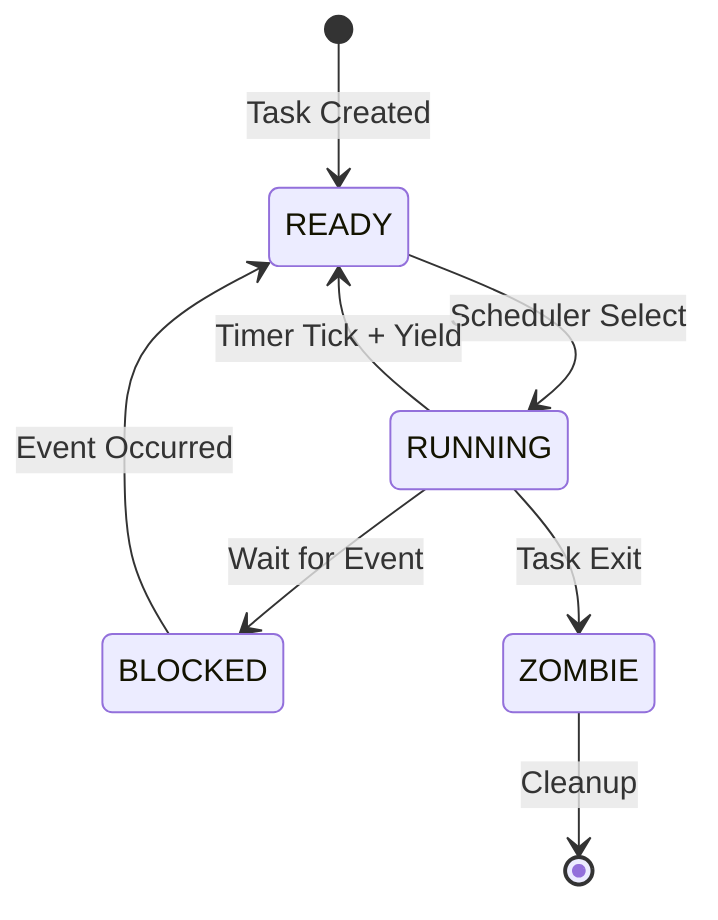
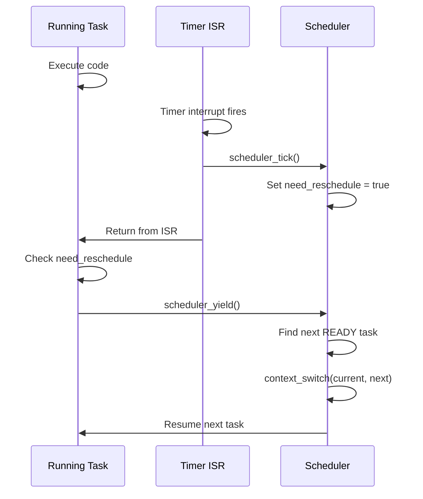

# 05 - Task and Scheduler

## Overview

VinixOS implement preemptive round-robin scheduler với 2 tasks:
- **Idle Task**: Kernel mode, chạy khi không có task nào khác
- **Shell Task**: User mode, interactive shell

Document này giải thích task structure, context switch mechanism, và scheduling algorithm.

## Task Structure

File: `VinixOS/kernel/include/task.h`

```c
struct task_context {
    /* General purpose registers (52 bytes) */
    uint32_t r0, r1, r2, r3, r4, r5, r6;
    uint32_t r7, r8, r9, r10, r11, r12;
    
    /* SVC mode registers (8 bytes) */
    uint32_t sp;      // r13_svc
    uint32_t lr;      // r14_svc
    
    /* Processor state (4 bytes) */
    uint32_t spsr;    // Saved Program Status Register
    
    /* User mode registers (8 bytes) */
    uint32_t sp_usr;  // r13_usr
    uint32_t lr_usr;  // r14_usr
    
    // Total: 72 bytes
};

struct task_struct {
    struct task_context context;    /* Saved CPU state */
    void *stack_base;               /* Stack bottom (high address) */
    uint32_t stack_size;            /* Stack size in bytes */
    uint32_t state;                 /* READY/RUNNING/BLOCKED/ZOMBIE */
    const char *name;               /* Task name */
    uint32_t id;                    /* Task ID */
};
```

**Task States**:
- READY: Sẵn sàng chạy
- RUNNING: Đang chạy
- BLOCKED: Đang chờ event (chưa implement)
- ZOMBIE: Task đã terminate


## Task Stack Initialization

File: `VinixOS/kernel/src/kernel/scheduler/task.c`

```c
void task_stack_init(struct task_struct *task, 
                     void (*entry_point)(void),
                     void *stack_base, 
                     uint32_t stack_size) {
    /* Stack grows down from stack_base */
    uint32_t *sp = (uint32_t *)((uint32_t)stack_base - stack_size);
    
    /* Place canary at stack bottom for overflow detection */
    *sp = STACK_CANARY_VALUE;  /* 0xDEADBEEF */
    sp++;
    
    /* Initialize context */
    memset(&task->context, 0, sizeof(struct task_context));
    
    /* Set entry point */
    task->context.lr = (uint32_t)entry_point;
    
    /* Set initial CPSR (in SPSR) */
    if ((uint32_t)entry_point >= USER_SPACE_VA) {
        /* User mode task */
        task->context.spsr = 0x10;  /* User mode, IRQ enabled */
        task->context.sp_usr = (uint32_t)stack_base;  /* User stack */
    } else {
        /* Kernel mode task */
        task->context.spsr = 0x13;  /* SVC mode, IRQ enabled */
    }
    
    /* Set stack pointer */
    task->context.sp = (uint32_t)sp;
    
    /* Save stack info */
    task->stack_base = stack_base;
    task->stack_size = stack_size;
}
```

**Initial Stack Frame**: Khi context_switch() load task lần đầu, nó sẽ restore registers từ context. LR chứa entry point, SPSR chứa initial CPSR.

**Stack Canary**: Magic value tại stack bottom để detect stack overflow.

**User vs Kernel Mode**: SPSR bit[4:0] = mode. 0x10 = User, 0x13 = SVC.


## Context Switch

File: `VinixOS/kernel/src/arch/arm/context_switch.S`

```asm
.global context_switch
context_switch:
    /* r0 = current task, r1 = next task */
    
    /* Save current task context */
    stmia   r0, {r0-r12}            /* Save r0-r12 */
    add     r0, r0, #52             /* Offset to sp field */
    str     sp, [r0], #4            /* Save SP_svc */
    str     lr, [r0], #4            /* Save LR_svc */
    mrs     r2, spsr
    str     r2, [r0], #4            /* Save SPSR */
    
    /* Save User mode SP and LR (if applicable) */
    cps     #0x10                   /* Switch to User mode */
    mov     r2, sp
    mov     r3, lr
    cps     #0x13                   /* Back to SVC mode */
    str     r2, [r0], #4            /* Save SP_usr */
    str     r3, [r0]                /* Save LR_usr */
    
    /* Restore next task context */
    ldmia   r1, {r0-r12}            /* Restore r0-r12 */
    add     r1, r1, #52
    ldr     sp, [r1], #4            /* Restore SP_svc */
    ldr     lr, [r1], #4            /* Restore LR_svc */
    ldr     r2, [r1], #4            /* Restore SPSR */
    msr     spsr, r2
    
    /* Restore User mode SP and LR */
    ldr     r2, [r1], #4            /* Load SP_usr */
    ldr     r3, [r1]                /* Load LR_usr */
    cps     #0x10                   /* Switch to User mode */
    mov     sp, r2
    mov     lr, r3
    cps     #0x13                   /* Back to SVC mode */
    
    /* Return to next task */
    movs    pc, lr                  /* Restore CPSR from SPSR and jump */
```

**STMIA/LDMIA**: Store/Load Multiple Increment After. Save/restore r0-r12 trong 1 instruction.

**Mode Switch**: Phải switch sang User mode để access SP_usr và LR_usr (banked registers).

**MOVS PC, LR**: Copy SPSR vào CPSR và jump đến LR. Đây là cách return từ exception và restore processor state.


## Scheduler Implementation

File: `VinixOS/kernel/src/kernel/scheduler/scheduler.c`

### Scheduler Data Structures

```c
#define MAX_TASKS 4

static struct task_struct *tasks[MAX_TASKS];
static uint32_t task_count = 0;
static struct task_struct *current_task = NULL;
static uint32_t current_task_index = 0;
static bool scheduler_started = false;

volatile bool need_reschedule = false;
```

**need_reschedule**: Flag set bởi timer ISR để signal tasks cần yield.

### Scheduler Tick (Timer ISR)

```c
void scheduler_tick(void) {
    if (!scheduler_started) return;
    
    /* Just set flag - don't context switch in IRQ mode */
    need_reschedule = true;
}
```

**Tại sao không context switch trong ISR**: 
- IRQ mode có stack riêng (nhỏ)
- Context switch cần SVC mode stack
- Unsafe để switch trong nested context

**Solution**: Set flag, tasks tự check và yield voluntarily.

### Scheduler Yield

```c
void scheduler_yield(void) {
    if (!need_reschedule) return;
    
    need_reschedule = false;
    
    /* Check stack canary */
    uint32_t *canary_ptr = (uint32_t *)current_task->stack_base;
    if (*canary_ptr != STACK_CANARY_VALUE) {
        PANIC("Stack overflow detected!");
    }
    
    /* Find next ready task (round-robin) */
    uint32_t next_index = current_task_index;
    struct task_struct *next_task = current_task;
    
    for (int i = 0; i < MAX_TASKS; i++) {
        next_index = (next_index + 1) % MAX_TASKS;
        if (tasks[next_index] && 
            tasks[next_index]->state == TASK_STATE_READY) {
            next_task = tasks[next_index];
            break;
        }
    }
    
    /* Update states */
    if (current_task->state != TASK_STATE_ZOMBIE) {
        current_task->state = TASK_STATE_READY;
    }
    next_task->state = TASK_STATE_RUNNING;
    
    /* Update scheduler state */
    struct task_struct *prev_task = current_task;
    current_task = next_task;
    current_task_index = next_index;
    
    /* Perform context switch */
    context_switch(prev_task, next_task);
}
```

**Round-Robin**: Loop qua task array, chọn task READY tiếp theo.

**Stack Canary Check**: Detect stack overflow trước khi switch.

**State Management**: Current task → READY, next task → RUNNING.


## Scheduling Flow Diagram



### Preemption Flow



## Task Examples

### Idle Task (Kernel Mode)

```c
void idle_task(void) {
    while (1) {
        /* Check if need to yield */
        extern volatile bool need_reschedule;
        if (need_reschedule) {
            scheduler_yield();
        }
        
        /* CPU idle - could use WFI instruction */
        __asm__ volatile("nop");
    }
}
```

**Idle Task Properties**:
- Kernel mode (CPSR = 0x13)
- Lowest priority (always READY)
- Never blocks, never exits
- Runs when no other task ready

### Shell Task (User Mode)

```c
/* Entry point: 0x40000000 */
void shell_main(void) {
    while (1) {
        /* Print prompt */
        write("$ ", 2);
        
        /* Read command */
        char buf[128];
        int n = read(buf, sizeof(buf));
        
        /* Process command */
        if (strcmp(buf, "ls") == 0) {
            /* List files... */
        }
        
        /* Yield CPU */
        yield();
    }
}
```

**Shell Task Properties**:
- User mode (CPSR = 0x10)
- Entry point: 0x40000000
- Stack: 0x40100000 - 4KB
- Preemptive với Idle task


## Timer Configuration

File: `VinixOS/kernel/src/drivers/timer.c`

```c
#define TIMER_FREQ_HZ 100  /* 100 Hz = 10ms tick */

void timer_init(void) {
    /* Enable timer clock */
    writel(0x2, CM_PER_TIMER2_CLKCTRL);
    
    /* Stop timer */
    writel(0, DMTIMER2_TCLR);
    
    /* Set reload value for 10ms @ 24MHz */
    uint32_t reload = 0xFFFFFFFF - (24000000 / TIMER_FREQ_HZ);
    writel(reload, DMTIMER2_TLDR);
    writel(reload, DMTIMER2_TCRR);
    
    /* Enable overflow interrupt */
    writel(0x2, DMTIMER2_IRQENABLE_SET);
    
    /* Register IRQ handler */
    irq_register_handler(TIMER_IRQ, timer_handler);
    intc_enable_interrupt(TIMER_IRQ, 40);
    
    /* Start timer: Auto-reload, Compare enabled, Start */
    writel(0x3, DMTIMER2_TCLR);
}

void timer_handler(void) {
    /* Clear interrupt flag */
    writel(0x2, DMTIMER2_IRQSTATUS);
    
    /* Call scheduler tick */
    scheduler_tick();
}
```

**Timer Frequency**: 100 Hz = 10ms time slice per task.

**Auto-reload**: Timer tự động reload TLDR vào TCRR khi overflow → periodic interrupt.

## Key Design Decisions

### 1. Cooperative Yield trong Preemptive Scheduler

**Problem**: Context switch trong IRQ mode unsafe.

**Solution**: Timer ISR chỉ set flag. Tasks tự check và yield.

**Tradeoff**: Tasks phải cooperative check flag. Nếu task không check, sẽ không bị preempt.

**Mitigation**: Tất cả tasks (kể cả Idle) check need_reschedule trong main loop.

### 2. Round-Robin Scheduling

**Decision**: Simple round-robin, no priorities.

**Rationale**: Đơn giản, fair, đủ cho 2 tasks.

**Production OS**: Sẽ dùng priority-based scheduling, CFS, hoặc real-time scheduler.

### 3. Static Task Array

**Decision**: Fixed MAX_TASKS = 4, static allocation.

**Rationale**: Không cần dynamic memory allocator.

**Tradeoff**: Không thể create tasks runtime. Acceptable cho reference OS.

## Key Takeaways

1. **Context = All CPU State**: Registers, SP, LR, CPSR. Phải save/restore tất cả.

2. **Preemption via Timer**: Timer interrupt trigger scheduler tick → set flag → tasks yield.

3. **Cooperative Yield**: Tasks phải check need_reschedule và gọi scheduler_yield().

4. **Round-Robin Fair**: Mỗi task có equal time slice (10ms).

5. **Stack Canary**: Detect stack overflow trước khi corrupt memory.

6. **Mode-aware Context Switch**: Phải save/restore cả SVC và User mode registers.

7. **Idle Task Always Ready**: Đảm bảo luôn có task để chạy.
