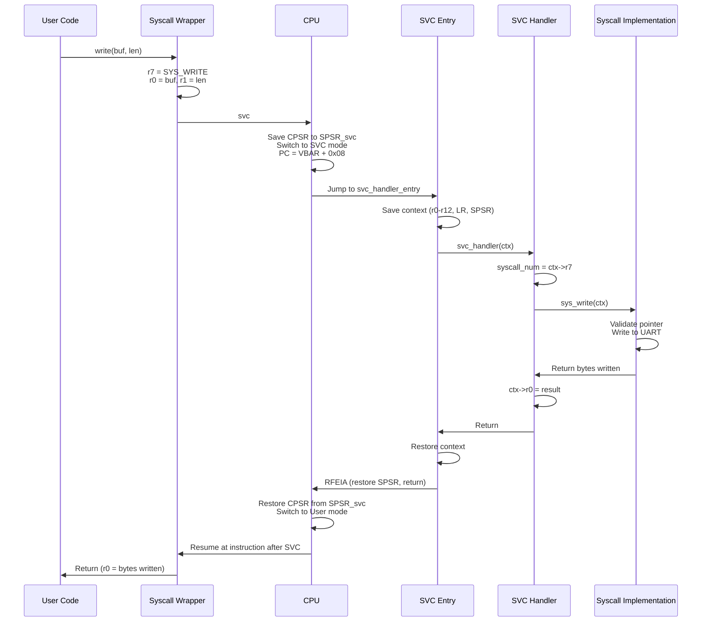

# 06 - System Call Mechanism

## Overview

System calls là interface giữa user space và kernel space. VinixOS implement syscalls qua SVC (Supervisor Call) exception theo AAPCS calling convention.

## AAPCS Calling Convention

ARM Architecture Procedure Call Standard (AAPCS) định nghĩa cách pass arguments và return values:

```
Arguments:  r0, r1, r2, r3 (first 4 args)
            Stack (additional args)
Return:     r0 (32-bit return value)
            r0, r1 (64-bit return value)
Scratch:    r0-r3, r12 (caller-saved)
Preserved:  r4-r11 (callee-saved)
```

**VinixOS Syscall ABI**:
```
r7 = Syscall number
r0-r3 = Arguments (up to 4)
r0 = Return value
```

**Tại sao r7**: Convention trong Linux ARM. r7 không conflict với AAPCS argument registers.

## Syscall Numbers

File: `VinixOS/kernel/include/syscalls.h`

```c
#define SYS_WRITE       0   /* write(buf, len) */
#define SYS_EXIT        1   /* exit(status) */
#define SYS_YIELD       2   /* yield() */
#define SYS_READ        3   /* read(buf, len) */
#define SYS_GET_TASKS   4   /* get_tasks(buf, max_count) */
#define SYS_GET_MEMINFO 5   /* get_meminfo(buf) */
#define SYS_OPEN        6   /* open(path, flags) */
#define SYS_READ_FILE   7   /* read_file(fd, buf, len) */
#define SYS_CLOSE       8   /* close(fd) */
#define SYS_LISTDIR     9   /* listdir(path, entries, max) */
#define SYS_EXEC        10  /* exec(path) */
```


## User-side Syscall Wrapper

File: `VinixOS/userspace/lib/syscall.S`

```asm
.global syscall
syscall:
    /* r0-r3 already contain arguments (AAPCS) */
    /* r7 = syscall number (set by caller) */
    svc #0              /* Trigger SVC exception */
    bx  lr              /* Return (r0 contains return value) */
```

**SVC #0**: Trigger SVC exception. Immediate value (#0) không được dùng trong VinixOS (syscall number trong r7).

**Example**: write() wrapper

```c
int write(const void *buf, uint32_t len) {
    register uint32_t r7 asm("r7") = SYS_WRITE;
    register uint32_t r0 asm("r0") = (uint32_t)buf;
    register uint32_t r1 asm("r1") = len;
    register uint32_t ret asm("r0");
    
    asm volatile(
        "svc #0"
        : "=r"(ret)
        : "r"(r7), "r"(r0), "r"(r1)
        : "memory"
    );
    
    return ret;
}
```

**Inline Assembly**: Đảm bảo arguments vào đúng registers theo ABI.

## Kernel-side SVC Handler

### Exception Entry

File: `VinixOS/kernel/src/arch/arm/entry/exception_entry.S`

```asm
svc_handler_entry:
    /* Adjust LR (already points to correct return address) */
    sub     lr, lr, #0
    
    /* Save context to SVC stack */
    srsdb   sp!, #0x13          /* Save LR_svc and SPSR_svc */
    push    {r0-r12, lr}        /* Save all registers */
    
    /* Call C handler */
    mov     r0, sp              /* Pass stack pointer (context) */
    bl      svc_handler
    
    /* Restore context */
    pop     {r0-r12, lr}
    rfeia   sp!                 /* Restore SPSR and return */
```

**SRSDB**: Store Return State Decrement Before. Save LR và SPSR vào stack.

**Context Pointer**: SP point đến saved context. C handler nhận pointer này.

**RFEIA**: Return From Exception Increment After. Restore SPSR vào CPSR và return.


### SVC Context Structure

File: `VinixOS/kernel/src/kernel/core/svc_handler.c`

```c
struct svc_context {
    uint32_t spsr;      /* Saved Program Status Register */
    uint32_t pad;       /* 8-byte alignment padding */
    uint32_t r0;
    uint32_t r1;
    uint32_t r2;
    uint32_t r3;
    uint32_t r4;
    uint32_t r5;
    uint32_t r6;
    uint32_t r7;
    uint32_t r8;
    uint32_t r9;
    uint32_t r10;
    uint32_t r11;
    uint32_t r12;
    uint32_t lr;        /* LR_svc (return address) */
};
```

**Stack Layout** (low → high address):
```
[SPSR] [PAD] [r0] [r1] [r2] ... [r12] [LR] ← SP
```

**Alignment**: AAPCS yêu cầu stack 8-byte aligned. PAD đảm bảo alignment.

### SVC Dispatcher

```c
void svc_handler(struct svc_context *ctx) {
    uint32_t syscall_num = ctx->r7;
    int32_t result = E_INVAL;
    
    switch (syscall_num) {
        case SYS_WRITE:
            result = sys_write(ctx);
            break;
        case SYS_EXIT:
            result = sys_exit(ctx);
            break;
        case SYS_YIELD:
            result = sys_yield(ctx);
            break;
        /* ... other syscalls ... */
        default:
            uart_printf("[SVC] Unknown syscall %d\n", syscall_num);
            result = E_INVAL;
            break;
    }
    
    /* Write return value to user's r0 */
    ctx->r0 = result;
}
```

**Dispatcher Pattern**: Switch trên syscall number, gọi handler tương ứng.

**Return Value**: Write vào ctx->r0. Khi return từ exception, r0 sẽ chứa return value.


## Syscall Implementations

### sys_write

```c
static int32_t sys_write(struct svc_context *ctx) {
    const void *buf = (const void *)ctx->r0;
    uint32_t len = (uint32_t)ctx->r1;
    
    /* Validate user pointer */
    if (validate_user_pointer(buf, len) != E_OK) {
        return E_PTR;  /* Invalid pointer */
    }
    
    /* Limit length to prevent DoS */
    if (len > 256) {
        return E_ARG;
    }
    
    /* Write to UART */
    const char *str = (const char *)buf;
    for (uint32_t i = 0; i < len; i++) {
        if (str[i] == '\n') {
            uart_putc('\r');  /* CR+LF for terminal */
        }
        uart_putc(str[i]);
    }
    
    return (int32_t)len;  /* Return bytes written */
}
```

**Pointer Validation**: Critical security check. User không được pass kernel pointers.

```c
static int validate_user_pointer(const void *ptr, uint32_t len) {
    uint32_t start = (uint32_t)ptr;
    uint32_t end = start + len;
    
    /* Check overflow */
    if (end < start) return E_PTR;
    
    /* Check bounds: must be in User Space (0x40000000 - 0x40FFFFFF) */
    if (start >= USER_SPACE_VA && 
        end <= USER_SPACE_VA + (USER_SPACE_MB * 1024 * 1024)) {
        return E_OK;
    }
    
    return E_PTR;
}
```

**Tại sao validate**: Nếu không check, user có thể pass kernel pointer và leak kernel memory hoặc corrupt kernel data.

### sys_yield

```c
static int32_t sys_yield(struct svc_context *ctx) {
    /* Set reschedule flag */
    extern volatile bool need_reschedule;
    need_reschedule = true;
    
    /* Voluntary yield */
    scheduler_yield();
    
    return E_OK;
}
```

**Voluntary Yield**: User task tự nguyện nhường CPU. Useful cho cooperative multitasking.

**Critical Fix**: Phải set need_reschedule trước khi gọi scheduler_yield(), nếu không yield có thể bị ignore.


### sys_read (Non-blocking I/O)

```c
static int32_t sys_read(struct svc_context *ctx) {
    void *buf = (void *)ctx->r0;
    uint32_t len = (uint32_t)ctx->r1;
    
    /* Validate pointer */
    if (validate_user_pointer(buf, len) != E_OK) {
        return E_PTR;
    }
    
    if (len == 0) return 0;
    
    /* Read 1 byte from UART (non-blocking) */
    char *c_buf = (char *)buf;
    int c = uart_getc();
    
    if (c == -1) {
        return 0;  /* No data available */
    }
    
    *c_buf = (char)c;
    return 1;  /* Read 1 byte */
}
```

**Non-blocking Design**: Return 0 nếu không có data. User phải retry.

**Tại sao không block trong kernel**:
- Blocking trong SVC handler nguy hiểm (exception context)
- Cần task sleep/wake mechanism (chưa implement)
- Non-blocking đơn giản và safe

**User-side Pattern**:
```c
char c;
while (read(&c, 1) == 0) {
    yield();  /* Yield CPU while waiting */
}
```

### sys_exit

```c
static int32_t sys_exit(struct svc_context *ctx) {
    int32_t status = (int32_t)ctx->r0;
    struct task_struct *current = scheduler_current_task();
    
    uart_printf("[SVC] Task %d exiting with status %d\n", 
                current->id, status);
    
    /* Terminate task */
    scheduler_terminate_task(current->id);
    
    /* Should not return (scheduler switches away) */
    return 0;
}
```

**Task Termination**: Mark task as ZOMBIE, scheduler sẽ không schedule nó nữa.

**Special Case**: Nếu Shell task exit, kernel reload shell payload và restart (để keep system interactive).


## Syscall Flow Diagram



## Error Codes

```c
#define E_OK     0      /* Success */
#define E_FAIL  -1      /* Generic failure */
#define E_INVAL -2      /* Invalid syscall number */
#define E_ARG   -3      /* Invalid argument */
#define E_PTR   -4      /* Invalid pointer */
#define E_PERM  -5      /* Permission denied */
#define E_NOENT -6      /* No such file */
#define E_BADF  -7      /* Bad file descriptor */
#define E_MFILE -8      /* Too many open files */
```

**Negative Return Values**: Indicate errors. Positive/zero = success.

**User-side Check**:
```c
int ret = write(buf, len);
if (ret < 0) {
    /* Handle error */
    if (ret == E_PTR) {
        printf("Invalid pointer\n");
    }
}
```

## Key Takeaways

1. **SVC = Controlled Kernel Entry**: User không thể jump trực tiếp vào kernel. Phải qua SVC exception.

2. **AAPCS Compliance**: Syscall ABI follow AAPCS để compatible với C calling convention.

3. **r7 = Syscall Number**: Convention trong Linux ARM. Không conflict với arguments.

4. **Pointer Validation Critical**: Kernel phải validate tất cả user pointers để prevent security holes.

5. **Context Modification**: Kernel có thể modify user context (r0 = return value) trước khi return.

6. **Non-blocking I/O**: Đơn giản và safe. Blocking I/O cần task sleep/wake mechanism.

7. **Error Handling**: Negative return values indicate errors. User phải check.

8. **Mode Switch Transparent**: User code không aware về mode switch. Chỉ thấy function call.
