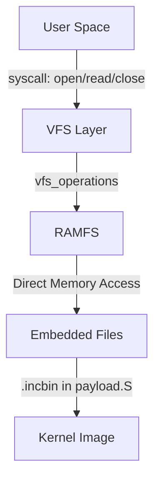
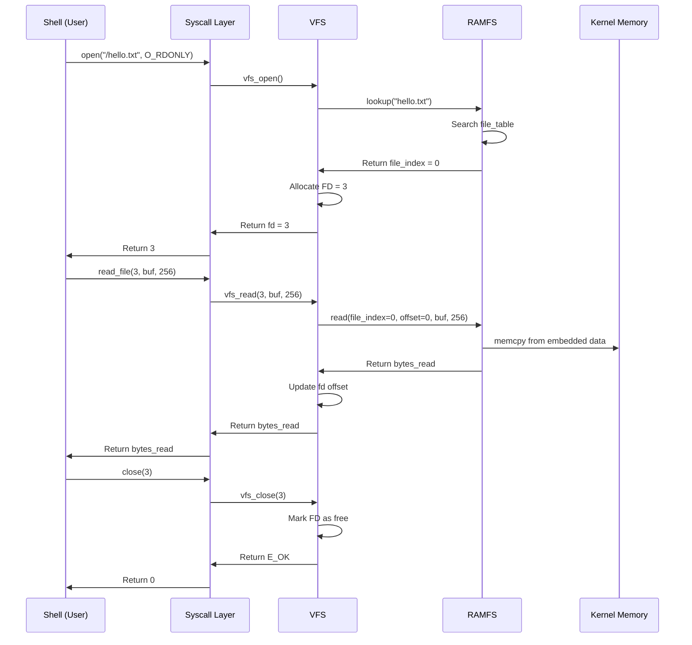

# 07 - Filesystem: VFS and RAMFS

## Overview

VinixOS implement 2-layer filesystem:
- **VFS (Virtual File System)**: Abstraction layer cho file operations
- **RAMFS**: In-memory filesystem implementation

Files được embed vào kernel image lúc build time qua `payload.S`.

## VFS Architecture



### VFS Operations Interface

File: `VinixOS/kernel/include/vfs.h`

```c
struct vfs_operations {
    int (*lookup)(const char *name);
    int (*read)(int file_index, uint32_t offset, void *buf, uint32_t len);
    int (*get_file_count)(void);
    int (*get_file_info)(int index, char *name, uint32_t *size);
};
```

**Abstraction**: VFS không care về filesystem implementation. Chỉ call operations qua function pointers.

**Mount**: VFS mount filesystem tại mount point (hiện tại chỉ support "/").

```c
int vfs_mount(const char *mount_point, struct vfs_operations *fs_ops);
```


### File Descriptor Table

```c
#define MAX_FDS 16

struct vfs_fd {
    bool in_use;
    uint32_t file_index;    /* Index into ramfs file table */
    uint32_t offset;        /* Current read position */
};

static struct vfs_fd fd_table[MAX_FDS];
```

**FD Management**: VFS maintain file descriptor table. FD 0-2 reserved cho stdin/stdout/stderr.

### VFS File Operations

**vfs_open()**:
```c
int vfs_open(const char *path, int flags) {
    /* Find filesystem for path */
    struct vfs_operations *fs_ops = vfs_find_fs(path);
    
    /* Strip leading '/' */
    const char *filename = path;
    if (*filename == '/') filename++;
    
    /* Lookup file in filesystem */
    int file_index = fs_ops->lookup(filename);
    if (file_index < 0) return E_NOENT;
    
    /* Allocate FD */
    int fd = -1;
    for (int i = 3; i < MAX_FDS; i++) {
        if (!fd_table[i].in_use) {
            fd = i;
            break;
        }
    }
    if (fd < 0) return E_MFILE;
    
    /* Initialize FD */
    fd_table[fd].in_use = true;
    fd_table[fd].file_index = file_index;
    fd_table[fd].offset = 0;
    
    return fd;
}
```

**vfs_read()**:
```c
int vfs_read(int fd, void *buf, uint32_t len) {
    /* Validate FD */
    if (fd < 0 || fd >= MAX_FDS || !fd_table[fd].in_use) {
        return E_BADF;
    }
    
    /* Read from filesystem */
    struct vfs_operations *fs_ops = vfs_find_fs("/");
    int bytes_read = fs_ops->read(
        fd_table[fd].file_index,
        fd_table[fd].offset,
        buf,
        len
    );
    
    /* Update offset */
    if (bytes_read > 0) {
        fd_table[fd].offset += bytes_read;
    }
    
    return bytes_read;
}
```

**vfs_close()**:
```c
int vfs_close(int fd) {
    if (fd < 0 || fd >= MAX_FDS || !fd_table[fd].in_use) {
        return E_BADF;
    }
    
    fd_table[fd].in_use = false;
    return E_OK;
}
```


## RAMFS Implementation

File: `VinixOS/kernel/src/kernel/fs/ramfs.c`

### File Table Structure

```c
#define MAX_RAMFS_FILES 16

struct ramfs_file {
    const char *name;
    const uint8_t *data;
    uint32_t size;
};

static struct ramfs_file file_table[MAX_RAMFS_FILES];
static uint32_t file_count = 0;
```

**Static File Table**: Files được register lúc init. Không support create/delete runtime.

### File Embedding

File: `VinixOS/kernel/src/kernel/files/` - chứa files cần embed

Build process:
1. Copy files vào `kernel/src/kernel/files/`
2. Makefile generate `payload.S`:

```asm
.section .rodata
.align 4

.global _file_hello_txt_start
.global _file_hello_txt_end
_file_hello_txt_start:
    .incbin "files/hello.txt"
_file_hello_txt_end:

.global _file_info_txt_start
.global _file_info_txt_end
_file_info_txt_start:
    .incbin "files/info.txt"
_file_info_txt_end:
```

3. Linker place `.rodata` section vào kernel image
4. RAMFS init register files:

```c
extern uint8_t _file_hello_txt_start[];
extern uint8_t _file_hello_txt_end[];
extern uint8_t _file_info_txt_start[];
extern uint8_t _file_info_txt_end[];

int ramfs_init(void) {
    file_count = 0;
    
    /* Register hello.txt */
    ramfs_register_file("hello.txt",
                        _file_hello_txt_start,
                        _file_hello_txt_end - _file_hello_txt_start);
    
    /* Register info.txt */
    ramfs_register_file("info.txt",
                        _file_info_txt_start,
                        _file_info_txt_end - _file_info_txt_start);
    
    return E_OK;
}
```

**Linker Symbols**: `_file_xxx_start` và `_file_xxx_end` là addresses trong kernel memory.


### RAMFS Operations

**lookup()**:
```c
static int ramfs_lookup(const char *name) {
    for (int i = 0; i < file_count; i++) {
        if (strcmp(file_table[i].name, name) == 0) {
            return i;  /* Return file index */
        }
    }
    return E_NOENT;  /* File not found */
}
```

**read()**:
```c
static int ramfs_read(int file_index, uint32_t offset, 
                      void *buf, uint32_t len) {
    if (file_index < 0 || file_index >= file_count) {
        return E_BADF;
    }
    
    struct ramfs_file *file = &file_table[file_index];
    
    /* Check offset */
    if (offset >= file->size) {
        return 0;  /* EOF */
    }
    
    /* Calculate bytes to read */
    uint32_t available = file->size - offset;
    uint32_t to_read = (len < available) ? len : available;
    
    /* Copy data */
    memcpy(buf, file->data + offset, to_read);
    
    return to_read;
}
```

**get_file_count() và get_file_info()**: Support `ls` command.

```c
static int ramfs_get_file_count(void) {
    return file_count;
}

static int ramfs_get_file_info(int index, char *name, uint32_t *size) {
    if (index < 0 || index >= file_count) {
        return E_ARG;
    }
    
    strcpy(name, file_table[index].name);
    *size = file_table[index].size;
    
    return E_OK;
}
```

### Register Operations với VFS

```c
static struct vfs_operations ramfs_ops = {
    .lookup = ramfs_lookup,
    .read = ramfs_read,
    .get_file_count = ramfs_get_file_count,
    .get_file_info = ramfs_get_file_info,
};

struct vfs_operations *ramfs_get_operations(void) {
    return &ramfs_ops;
}
```

**Mount trong kernel_main()**:
```c
vfs_init();
ramfs_init();
vfs_mount("/", ramfs_get_operations());
```


## Shell Commands

### ls Command

```c
void cmd_ls(void) {
    file_info_t entries[16];
    int count = listdir("/", entries, 16);
    
    if (count < 0) {
        write("Error listing directory\n", 24);
        return;
    }
    
    for (int i = 0; i < count; i++) {
        write(entries[i].name, strlen(entries[i].name));
        write("  ", 2);
        
        /* Print size */
        char size_buf[16];
        itoa(entries[i].size, size_buf);
        write(size_buf, strlen(size_buf));
        write(" bytes\n", 7);
    }
}
```

**listdir() syscall**: Return array of file_info_t.

### cat Command

```c
void cmd_cat(const char *filename) {
    int fd = open(filename, O_RDONLY);
    if (fd < 0) {
        write("File not found\n", 15);
        return;
    }
    
    char buf[256];
    int n;
    while ((n = read_file(fd, buf, sizeof(buf))) > 0) {
        write(buf, n);
    }
    
    close(fd);
}
```

**read_file() syscall**: Read from file descriptor.

## File Access Flow



## Key Takeaways

1. **VFS Abstraction**: Decouple file operations từ filesystem implementation. Dễ add filesystem mới.

2. **RAMFS = Read-only**: Files embed lúc build, không thể modify runtime. Đủ cho reference OS.

3. **File Embedding**: `.incbin` directive embed binary data vào kernel image. Linker symbols provide addresses.

4. **FD Management**: VFS maintain FD table, track offset per FD. Standard POSIX-like interface.

5. **No Dynamic Allocation**: File table static. Không cần memory allocator.

6. **Simple but Functional**: Đủ để implement `ls` và `cat` commands. Demonstrate filesystem concepts.

7. **Extensible**: Dễ add filesystem mới (FAT, ext2) bằng cách implement vfs_operations interface.
