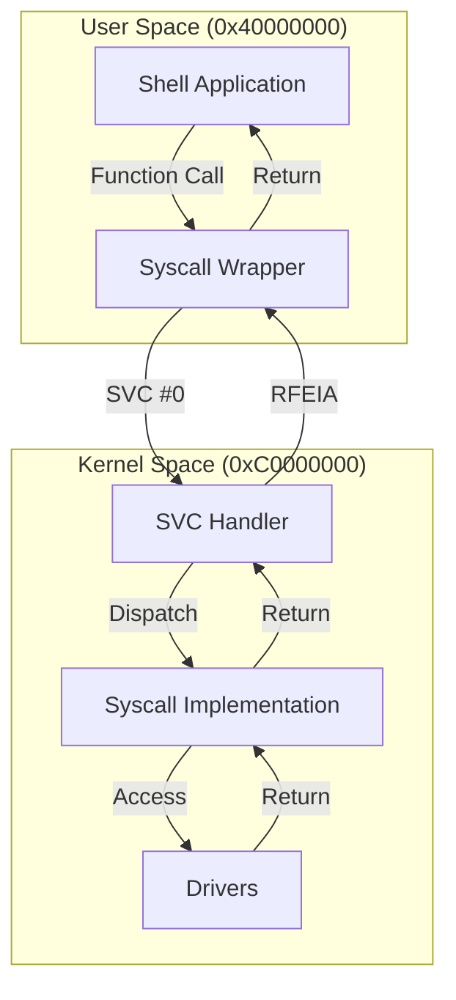

# 08 - Userspace Application

## Overview

Userspace là environment cho user applications chạy isolated từ kernel. VinixOS userspace bao gồm:
- **Runtime**: crt0.S, linker script
- **Library**: Syscall wrappers, libc functions
- **Applications**: Shell

## Userspace Structure

```
VinixOS/userspace/
├── apps/           # User applications
│   └── shell/      # Interactive shell
├── lib/            # Syscall wrappers
├── libc/           # Minimal C library
├── linker/         # Linker scripts
└── include/        # Headers
```

## Memory Layout

```
User Space (0x40000000 - 0x40FFFFFF):

0x40000000          ← .text (code)
    |
    v
0x400XXXXX          ← .rodata (read-only data)
    |
    v
0x400YYYYY          ← .data (initialized data)
    |
    v
0x400ZZZZZ          ← .bss (uninitialized data)
    |
    v
0x400ZZZZZ          ← Heap (grows up) [not implemented]
    |
    |
    v
0x400FC000          ← Stack (grows down, 16KB)
    |
    v
0x40100000          ← Stack base (top of User Space)
```

**Fixed Addresses**: Application link tại 0x40000000. Kernel load binary vào địa chỉ này.


## Runtime Startup (crt0.S)

File: `VinixOS/userspace/lib/crt0.S`

```asm
.section .text.startup
.global _start

_start:
    /* Setup stack pointer */
    ldr sp, =_stack_top
    
    /* Clear BSS section */
    ldr r0, =_bss_start
    ldr r1, =_bss_end
    mov r2, #0
1:
    cmp r0, r1
    strlo r2, [r0], #4
    blo 1b
    
    /* Call main() */
    bl main
    
    /* Exit with return value from main */
    mov r0, r0          /* main() return value already in r0 */
    mov r7, #1          /* SYS_EXIT */
    svc #0
    
    /* Should never reach here */
halt:
    b halt
```

**_start**: Entry point của user application. Kernel jump đến đây khi load app.

**Stack Setup**: Load SP từ linker symbol `_stack_top`.

**BSS Clear**: Zero-initialize uninitialized global variables.

**main() Call**: Standard C entry point.

**Exit**: Call sys_exit() với return value từ main().

## Linker Script

File: `VinixOS/userspace/linker/app.ld`

```ld
OUTPUT_FORMAT("elf32-littlearm")
OUTPUT_ARCH(arm)
ENTRY(_start)

MEMORY {
    USER_SPACE (rwx) : ORIGIN = 0x40000000, LENGTH = 1M
}

SECTIONS {
    . = 0x40000000;
    
    .text : {
        *(.text.startup)    /* crt0.S _start */
        *(.text*)
    } > USER_SPACE
    
    .rodata : {
        *(.rodata*)
    } > USER_SPACE
    
    .data : {
        _data_start = .;
        *(.data*)
        _data_end = .;
    } > USER_SPACE
    
    .bss : {
        _bss_start = .;
        *(.bss*)
        *(COMMON)
        _bss_end = .;
    } > USER_SPACE
    
    /* Stack at end of User Space */
    . = 0x40100000 - 0x4000;  /* 16KB stack */
    _stack_bottom = .;
    . = 0x40100000;
    _stack_top = .;
}
```

**ORIGIN = 0x40000000**: Application load address.

**Stack Placement**: 16KB stack tại end of User Space (0x400FC000 - 0x40100000).

**Linker Symbols**: `_bss_start`, `_bss_end`, `_stack_top` used by crt0.S.


## Syscall Wrappers

File: `VinixOS/userspace/lib/syscall.c`

```c
int write(const void *buf, uint32_t len) {
    register uint32_t r7 asm("r7") = SYS_WRITE;
    register uint32_t r0 asm("r0") = (uint32_t)buf;
    register uint32_t r1 asm("r1") = len;
    register uint32_t ret asm("r0");
    
    asm volatile(
        "svc #0"
        : "=r"(ret)
        : "r"(r7), "r"(r0), "r"(r1)
        : "memory"
    );
    
    return ret;
}

void exit(int status) {
    register uint32_t r7 asm("r7") = SYS_EXIT;
    register uint32_t r0 asm("r0") = status;
    
    asm volatile(
        "svc #0"
        :
        : "r"(r7), "r"(r0)
        : "memory"
    );
    
    __builtin_unreachable();
}

void yield(void) {
    register uint32_t r7 asm("r7") = SYS_YIELD;
    
    asm volatile(
        "svc #0"
        :
        : "r"(r7)
        : "memory"
    );
}

int read(void *buf, uint32_t len) {
    register uint32_t r7 asm("r7") = SYS_READ;
    register uint32_t r0 asm("r0") = (uint32_t)buf;
    register uint32_t r1 asm("r1") = len;
    register uint32_t ret asm("r0");
    
    asm volatile(
        "svc #0"
        : "=r"(ret)
        : "r"(r7), "r"(r0), "r"(r1)
        : "memory"
    );
    
    return ret;
}
```

**Inline Assembly**: Đảm bảo arguments vào đúng registers theo syscall ABI.

**Register Constraints**: `"r"(r7)` force compiler place value vào r7.

**Memory Clobber**: `"memory"` tell compiler syscall có thể modify memory.


## Shell Application

File: `VinixOS/userspace/apps/shell/main.c`

```c
int main(void) {
    char cmd_buf[128];
    
    write("\nVinixOS Shell\n", 14);
    write("Type 'help' for commands\n\n", 26);
    
    while (1) {
        /* Print prompt */
        write("$ ", 2);
        
        /* Read command */
        int cmd_len = 0;
        while (1) {
            char c;
            int n = read(&c, 1);
            
            if (n == 0) {
                yield();  /* No data, yield CPU */
                continue;
            }
            
            if (c == '\r' || c == '\n') {
                write("\n", 1);
                break;
            }
            
            if (c == '\b' || c == 0x7F) {  /* Backspace */
                if (cmd_len > 0) {
                    cmd_len--;
                    write("\b \b", 3);  /* Erase character */
                }
                continue;
            }
            
            if (cmd_len < sizeof(cmd_buf) - 1) {
                cmd_buf[cmd_len++] = c;
                write(&c, 1);  /* Echo */
            }
        }
        
        cmd_buf[cmd_len] = '\0';
        
        /* Process command */
        if (cmd_len == 0) {
            continue;
        }
        
        if (strcmp(cmd_buf, "help") == 0) {
            cmd_help();
        } else if (strcmp(cmd_buf, "ls") == 0) {
            cmd_ls();
        } else if (strncmp(cmd_buf, "cat ", 4) == 0) {
            cmd_cat(cmd_buf + 4);
        } else if (strcmp(cmd_buf, "ps") == 0) {
            cmd_ps();
        } else if (strcmp(cmd_buf, "meminfo") == 0) {
            cmd_meminfo();
        } else {
            write("Unknown command: ", 17);
            write(cmd_buf, cmd_len);
            write("\n", 1);
        }
    }
    
    return 0;
}
```

**Main Loop**: Read command → Process → Repeat.

**Non-blocking Read**: read() return 0 nếu no data. Shell yield() và retry.

**Echo**: Shell echo characters để user thấy input.

**Backspace Handling**: Erase character từ buffer và terminal.


## Build Process

### Makefile

```makefile
# Cross-compiler
CC = arm-none-eabi-gcc
LD = arm-none-eabi-ld
OBJCOPY = arm-none-eabi-objcopy

# Flags
CFLAGS = -march=armv7-a -mfloat-abi=soft -nostdlib -nostartfiles
CFLAGS += -I../include -I../libc/include
LDFLAGS = -T../linker/app.ld

# Sources
OBJS = ../lib/crt0.o
OBJS += main.o commands.o
OBJS += ../lib/syscall.o
OBJS += ../libc/string.o

# Build
shell.elf: $(OBJS)
    $(LD) $(LDFLAGS) -o $@ $(OBJS)

shell.bin: shell.elf
    $(OBJCOPY) -O binary $< $@

%.o: %.c
    $(CC) $(CFLAGS) -c -o $@ $<

%.o: %.S
    $(CC) $(CFLAGS) -c -o $@ $<
```

**Cross-compiler**: arm-none-eabi-gcc cho ARMv7-A bare-metal.

**nostdlib**: Không link standard library. User app tự implement cần thiết.

**Binary Output**: objcopy convert ELF sang raw binary để kernel load.

### Embedding vào Kernel

File: `VinixOS/kernel/src/kernel/payload.S`

```asm
.section .rodata
.align 4

.global _shell_payload_start
.global _shell_payload_end

_shell_payload_start:
    .incbin "../../userspace/build/shell.bin"
_shell_payload_end:
```

**Build Order**:
1. Build userspace: `make -C userspace`
2. Build kernel: `make -C kernel` (embed shell.bin)
3. Create SD image: `make sdcard`

## Privilege Levels

### User Mode (CPSR = 0x10)

**Restrictions**:
- Không access kernel memory (MMU enforce)
- Không access peripheral registers
- Không modify CPSR mode bits
- Không execute privileged instructions (MSR, MCR, MRC)

**Allowed**:
- Execute code trong User Space
- Access User Space memory
- Call syscalls (SVC instruction)

### Kernel Mode (CPSR = 0x13 SVC)

**Privileges**:
- Access tất cả memory
- Access peripheral registers
- Modify CPSR
- Execute privileged instructions

**Entry Points**:
- Syscalls (SVC)
- Exceptions (Abort, Undefined)
- Interrupts (IRQ)


## User/Kernel Boundary



**Boundary Enforcement**:
1. **MMU**: User không thể access kernel VA (Permission Fault)
2. **Mode Bits**: User không thể switch sang kernel mode (Undefined Instruction)
3. **SVC**: Controlled entry point vào kernel

## Key Takeaways

1. **Isolated Execution**: User app chạy tại 0x40000000, isolated từ kernel tại 0xC0000000.

2. **Runtime Startup**: crt0.S setup stack và BSS trước khi gọi main().

3. **Linker Script**: Define memory layout và entry point.

4. **Syscall Wrappers**: Hide SVC instruction, provide C function interface.

5. **Non-blocking I/O**: Shell phải yield() khi wait for input.

6. **Binary Embedding**: Shell binary embed vào kernel image, load lúc boot.

7. **Privilege Separation**: MMU và CPU mode bits enforce user/kernel boundary.

8. **Build Toolchain**: Cross-compiler (arm-none-eabi-gcc) cho bare-metal ARMv7-A.

9. **No Standard Library**: User app tự implement hoặc dùng minimal libc.

10. **Fixed Address**: Application luôn load tại 0x40000000. Không support position-independent code (PIC).
