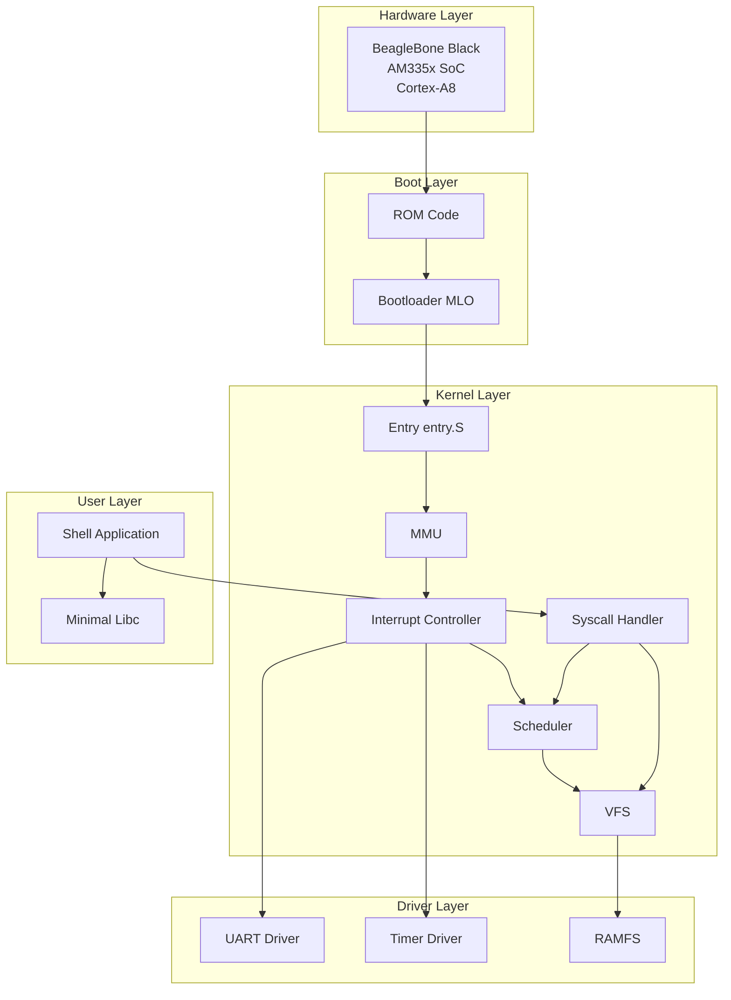
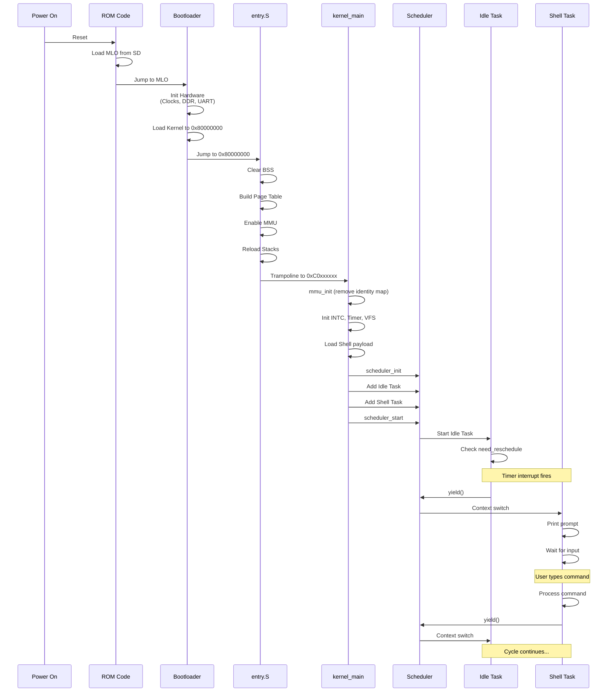
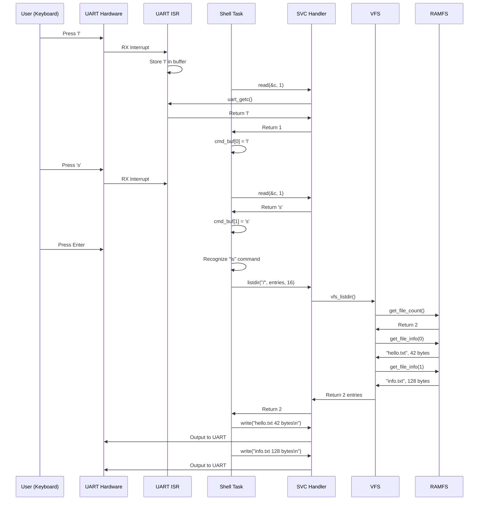

# 99 - System Overview

## Big Picture

VinixOS là reference operating system cho ARMv7-A, demonstrate các concepts cơ bản của OS design:
- Boot sequence
- Memory management (MMU)
- Exception handling
- Task scheduling
- System calls
- Filesystem
- User/kernel separation

Document này tổng hợp tất cả components và show cách chúng fit together.

## System Architecture




## Complete Boot to Shell Flow



## Data Flow: User Input → Output

Example: User types "ls" command




## Memory Map (Complete)

```
Physical Memory:
0x00000000 - 0x001FFFFF: Boot ROM (2MB)
0x402F0000 - 0x4030FFFF: Internal SRAM (128KB) - MLO loads here
0x44E00000 - 0x44E0FFFF: L4_WKUP Peripherals
0x48000000 - 0x482FFFFF: L4_PER Peripherals
0x80000000 - 0x9FFFFFFF: DDR3 RAM (512MB)

Virtual Memory (After mmu_init):
0x00000000 - 0x3FFFFFFF: Unmapped (Translation Fault)
0x40000000 - 0x40FFFFFF: User Space (16MB) → PA 0x80000000
                         AP=11 (User RW, Kernel RW)
                         Cached
0x41000000 - 0xBFFFFFFF: Unmapped
0xC0000000 - 0xC7FFFFFF: Kernel Space (128MB) → PA 0x80000000
                         AP=01 (Kernel-only)
                         Cached
0xC8000000 - 0x44DFFFFF: Unmapped
0x44E00000 - 0x44E0FFFF: L4_WKUP (Identity) → PA 0x44E00000
                         AP=01 (Kernel-only)
                         Strongly Ordered
0x44E10000 - 0x47FFFFFF: Unmapped
0x48000000 - 0x482FFFFF: L4_PER (Identity) → PA 0x48000000
                         AP=01 (Kernel-only)
                         Strongly Ordered
0x48300000 - 0xFFFFFFFF: Unmapped
```

**Key Points**:
- User và Kernel share physical memory (PA 0x80000000) nhưng có separate VA ranges
- Peripherals identity mapped (VA == PA) cho simplicity
- Unmapped regions cause Translation Fault nếu access

## Component Interactions

### 1. Timer → Scheduler → Tasks

```
Timer Hardware (10ms periodic)
    ↓ IRQ
INTC (route IRQ 68)
    ↓
CPU (IRQ exception)
    ↓
irq_handler_entry (save context)
    ↓
irq_handler (C code)
    ↓
timer_handler (clear interrupt)
    ↓
scheduler_tick (set need_reschedule flag)
    ↓
Return from IRQ
    ↓
Task checks need_reschedule
    ↓
scheduler_yield (context switch)
    ↓
Next task runs
```


### 2. Shell → Syscall → Kernel → Hardware

```
Shell (User Mode, 0x40000000)
    ↓ write("hello\n", 6)
Syscall Wrapper (r7=SYS_WRITE, r0=buf, r1=len)
    ↓ svc #0
CPU (SVC exception, switch to SVC mode)
    ↓
svc_handler_entry (save context)
    ↓
svc_handler (dispatcher)
    ↓
sys_write (validate pointer, call driver)
    ↓
uart_putc (write to UART registers)
    ↓
UART Hardware (transmit byte)
    ↓
Return through exception handler
    ↓
Shell continues (User Mode)
```

### 3. File Access Flow

```
Shell: open("/hello.txt")
    ↓
SVC Handler: sys_open
    ↓
VFS: vfs_open
    ↓
VFS: vfs_find_fs("/") → ramfs_ops
    ↓
RAMFS: ramfs_lookup("hello.txt") → file_index=0
    ↓
VFS: Allocate FD=3, map to file_index=0
    ↓
Return FD=3 to Shell

Shell: read_file(3, buf, 256)
    ↓
SVC Handler: sys_read_file
    ↓
VFS: vfs_read(3, buf, 256)
    ↓
VFS: Lookup FD=3 → file_index=0, offset=0
    ↓
RAMFS: ramfs_read(0, 0, buf, 256)
    ↓
RAMFS: memcpy from embedded data
    ↓
VFS: Update FD offset
    ↓
Return bytes_read to Shell

Shell: close(3)
    ↓
VFS: vfs_close(3)
    ↓
VFS: Mark FD=3 as free
    ↓
Return to Shell
```

## Design Principles

### 1. Simplicity Over Features

**Decision**: Implement minimal features cần thiết để demonstrate OS concepts.

**Examples**:
- 1-level page table (không phải 2-level)
- Round-robin scheduler (không phải priority-based)
- Static task array (không phải dynamic allocation)
- RAMFS read-only (không phải writable filesystem)

**Rationale**: Reference OS để học, không phải production. Simplicity giúp hiểu rõ concepts.

### 2. Correctness Over Performance

**Decision**: Prioritize correct implementation over optimization.

**Examples**:
- Flush TLB entire (không phải selective)
- No nested interrupts (đơn giản, safe)
- Cooperative yield trong preemptive scheduler (safe context switch)

**Rationale**: Correct code dễ optimize sau. Incorrect code khó debug.


### 3. Explicit Over Implicit

**Decision**: Make behavior explicit trong code, không rely on defaults.

**Examples**:
- Explicit MMU setup (không assume bootloader state)
- Explicit stack reload sau MMU enable
- Explicit pointer validation trong syscalls
- Explicit TLB flush sau page table modify

**Rationale**: Explicit code dễ understand và debug. Implicit behavior gây confusion.

### 4. Isolation Over Sharing

**Decision**: Separate user và kernel space rõ ràng.

**Examples**:
- True 3G/1G split (User 0x40000000, Kernel 0xC0000000)
- MMU enforce user/kernel boundary
- Syscalls là only way user access kernel services
- Pointer validation prevent user corrupt kernel

**Rationale**: Isolation prevent bugs và security issues. Clear boundary giúp reasoning về code.

## Key Achievements

VinixOS successfully demonstrates:

1. **Complete Boot Sequence**: ROM → Bootloader → Kernel → Tasks
2. **MMU Management**: Virtual memory với user/kernel separation
3. **Exception Handling**: 7 exception types với proper handlers
4. **Preemptive Multitasking**: Timer-driven scheduler với context switch
5. **System Call Interface**: AAPCS-compliant syscall ABI
6. **Filesystem Abstraction**: VFS layer với RAMFS implementation
7. **User Space Isolation**: Shell chạy tại User mode, isolated từ kernel
8. **Interactive System**: Shell accept commands và execute

## Limitations (By Design)

1. **Single Core**: Không support SMP
2. **No Dynamic Memory**: Tất cả static allocation
3. **Limited Tasks**: MAX_TASKS = 4
4. **Read-only Filesystem**: RAMFS không support write
5. **No Process Creation**: Tasks fixed lúc boot
6. **No Virtual Memory Management**: Page table static
7. **No Networking**: Không có network stack
8. **No Power Management**: Không có sleep/suspend

**Rationale**: Đây là reference OS, không phải production. Limitations giữ code đơn giản và focused.

## Future Extensions (Phase 2)

Sau khi hoàn thành Phase 1, có thể extend:

1. **Self-hosted Compiler**: Compiler nhắm ARMv7-A, output chạy trên VinixOS
2. **Dynamic Process Creation**: exec() syscall load ELF từ filesystem
3. **Writable Filesystem**: FAT32 hoặc simple filesystem
4. **Memory Allocator**: malloc/free implementation
5. **More Syscalls**: fork, pipe, socket, etc.
6. **Multi-core Support**: SMP scheduler
7. **Device Drivers**: GPIO, I2C, SPI

## Documentation Structure

Đọc docs theo thứ tự:

1. **01-boot-and-bringup.md**: Hiểu boot sequence
2. **02-kernel-initialization.md**: Hiểu kernel startup
3. **03-memory-and-mmu.md**: Hiểu memory management
4. **04-interrupt-and-exception.md**: Hiểu exception handling
5. **05-task-and-scheduler.md**: Hiểu multitasking
6. **06-syscall-mechanism.md**: Hiểu user/kernel interface
7. **07-filesystem-vfs-ramfs.md**: Hiểu filesystem
8. **08-userspace-application.md**: Hiểu user applications
9. **99-system-overview.md**: Big picture (file này)

Mỗi doc standalone nhưng reference qua lại khi cần.

## Conclusion

VinixOS là complete reference platform demonstrate OS fundamentals trên real hardware. Code đơn giản, well-documented, và functional. Đây là foundation tốt để:

- Học OS concepts
- Hiểu ARM architecture
- Phát triển compiler (Phase 2)
- Experiment với OS design

Tất cả design decisions được document rõ ràng với rationale. Code có thể tái triển khai độc lập dựa trên docs này.
