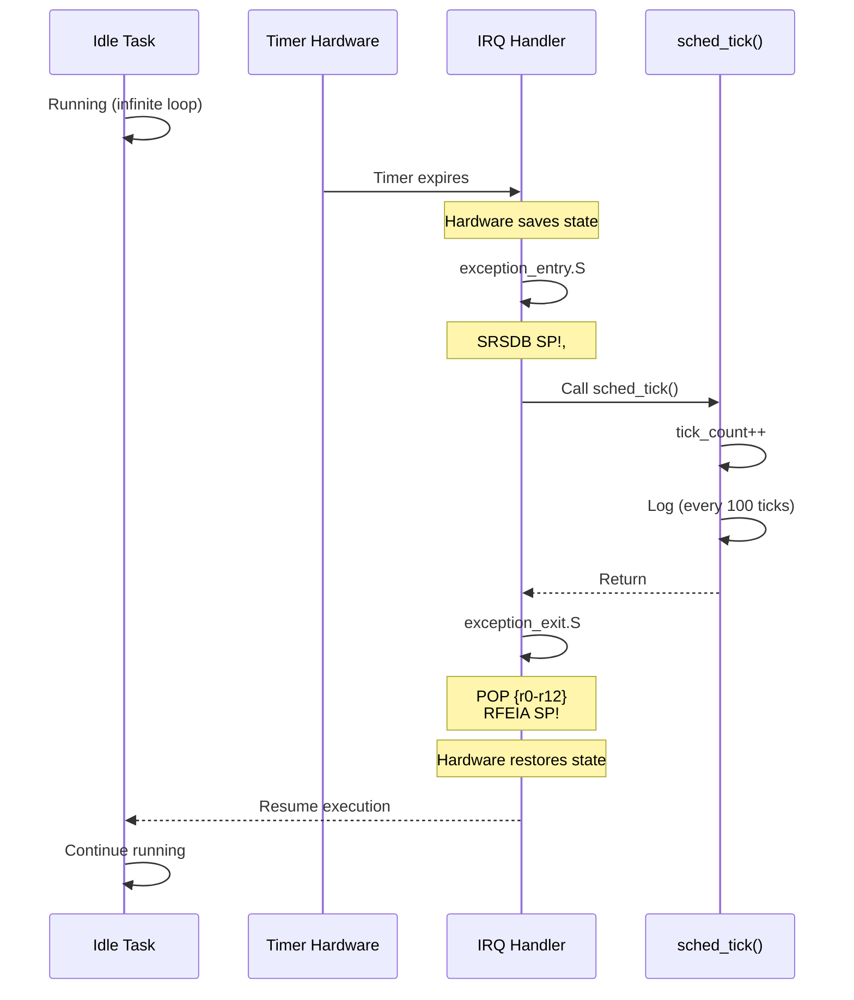

# Phase 1: Foundation - Single Task Baseline

## Objective

Establish a **minimal working baseline** cho scheduler subsystem:
- Support **chỉ 1 task** (idle task)
- **Không có context switching**
- Verify timer interrupt hoạt động đúng
- Verify stack initialization chính xác

## Architecture

### Single-Task Scheduler Model

```
┌─────────────────────────────────────┐
│  Kernel Boot                        │
└──────────────┬──────────────────────┘
               │
               ▼
┌──────────────────────────────────────┐
│  sched_init()                        │
│  - Reset scheduler state             │
│  - current_task = NULL               │
└──────────────┬───────────────────────┘
               │
               ▼
┌──────────────────────────────────────┐
│  sched_add_task("idle", ...)         │
│  - Create ONLY ONE task              │
│  - Initialize stack frame            │
│  - Reject additional tasks           │
└──────────────┬───────────────────────┘
               │
               ▼
┌──────────────────────────────────────┐
│  sched_start()                       │
│  - Set current_task = &single_task   │
│  - Call start_first_task()           │
│  - NEVER RETURNS                     │
└──────────────┬───────────────────────┘
               │
               ▼
┌──────────────────────────────────────┐
│  Idle Task Runs Forever              │
│  - Prints periodic messages          │
│  - Timer interrupts fire             │
│  - sched_tick() logs và returns      │
└──────────────────────────────────────┘
```

### Stack Frame Layout

Phase 1 implements **exact ARM exception frame layout**:

```
Memory Layout (Low → High Address):
┌───────────────────────────────┐
│                               │
│  Unused Stack Space           │
│                               │
├───────────────────────────────┤  ← task->sp (points here)
│  r0  = entry_point            │  +0 bytes
│  r1  = 0                      │  +4
│  r2  = 0                      │  +8
│  r3  = 0                      │  +12
│  r4  = 0                      │  +16
│  r5  = 0                      │  +20
│  r6  = 0                      │  +24
│  r7  = 0                      │  +28
│  r8  = 0                      │  +32
│  r9  = 0                      │  +36
│  r10 = 0                      │  +40
│  r11 = 0                      │  +44
│  r12 = 0                      │  +48
├───────────────────────────────┤
│  GAP (52 bytes)               │  +52 (13 words * 4)
│  (Unused space)               │
├───────────────────────────────┤
│  LR_irq = task_start_wrapper  │  +52 bytes from SP
│  SPSR   = SVC mode, IRQ ena   │  +56 bytes from SP
└───────────────────────────────┘  ← stack_base

CRITICAL: 52-byte gap exists because:
- SRSDB saves [LR, SPSR] at HIGH address
- PUSH {r0-r12} saves GPRs at LOW address
- They don't overlap!
```

### Timer Interrupt Flow



## Implementation Details

### scheduler.c Changes

**Simplifications:**
1. Removed task array - только `single_task`
2. Removed next_task_index
3. `sched_add_task()` rejects nếu task đã exists
4. `sched_tick()` chỉ log, không switch
5. Added tick counter với modulo 100 logging

**Key Functions:**
- `sched_init()`: Reset state
- `sched_add_task()`: Create single task only
- `sched_start()`: Start task và never return
- `sched_tick()`: Log và return immediately

### task_stack_init.S Changes

**Complete Rewrite:**
1. Detailed comments giải thích ARM behavior
2. Fix bug: Save r1 (entry_point) vào r5 ngay đầu
3. Build exception frame first (high address)
4. Create 52-byte gap
5. Build GPR frame last (low address)

**Critical Fix:**
```asm
; OLD (BROKEN):
push {r4-r6, lr}
; ... use r1 later (BUG: r1 corrupted!)

; NEW (FIXED):  
push {r4-r6, lr}
mov r5, r1              ; Save entry_point immediately
; ... use r5 later (SAFE)
```

### task.c Changes

**Added Debug Logging:**
1. Print all task creation parameters
2. Dump stack frame content sau khi init
3. Verify r0, LR, SPSR values
4. Print warnings nếu values không match expected

## Verification Criteria

### Success Criteria

Phase 1 được coi là **SUCCESS** nếu:

- [x] Code compiles without errors
- [ ] Kernel boots successfully  
- [ ] Idle task starts và runs
- [ ] Timer interrupts fire every 10ms
- [ ] `sched_tick()` logs every 100 ticks
- [ ] No Prefetch Abort
- [ ] No Data Abort
- [ ] UART output clean và readable
- [ ] Stack frame values correct (from debug output)

### Expected Output

```
[SCHED] Phase 1 initialized (single task mode)

[TASK] Creating 'idle'
   Entry point: 0x80001234
   Stack base:  0x80010000
   Stack size:  4096 bytes
   SPSR:        0x000000D3 (SVC mode, IRQ enabled)
   LR:          0x80001500 (task_start_wrapper)
   Final SP:    0x8000FF38
   Stack used:  200 bytes

   Stack Frame Content:
   [SP + 0]  = 0x80001234  (r0  = entry_point)
   [SP + 4]  = 0x00000000  (r1)
   [SP + 8]  = 0x00000000  (r2)
   [SP + 48] = 0x00000000  (r12)
   [SP + 52] = 0x80001500  (LR_irq)
   [SP + 56] = 0x000000D3  (SPSR)

[TASK] Created 'idle' successfully

[SCHED] Added single task: 'idle'

=================================================
 SCHEDULER PHASE 1: Starting Single Task Baseline
=================================================
Task: idle
Stack Base: 0x80010000
Stack SP:   0x8000FF38
Stack Size: 4096 bytes
=================================================

[SCHED] Launching task...

[IDLE] Task started
[IDLE] Running...
[TICK 100] Timer interrupt - idle continues
[IDLE] Running...
[TICK 200] Timer interrupt - idle continues
...
```

### Failure Modes

| Symptom | Possible Cause | Debug Step |
|---------|----------------|------------|
| Prefetch Abort on task start | LR value invalid | Check `[SP + 52]` in debug output |
| Data Abort immediately | SP alignment wrong | Check SP alignment (must be 8-byte) |
| No timer ticks | IRQ not enabled in SPSR | Check `[SP + 56]` bit 7 = 0 |
| Task doesn't start | r0 doesn't contain entry_point | Check `[SP + 0]` in debug output |

## Known Limitations (Phase 1 Only)

1. **Chỉ 1 task**: Second `sched_add_task()` call sẽ fail
2. **Tidak ada context switch**: `sched_tick()` chỉ log
3. **Tidak ada multi-tasking**: Round-robin chưa implement
4. **Debug output verbose**: Sẽ remove trong phase sau

## Next Phase

Phase 2 sẽ add **Stack Frame Validation** tools để verify:
- Exception frame position correct
- GPR frame position correct
- Gap size exactly 52 bytes
- All values match expected
