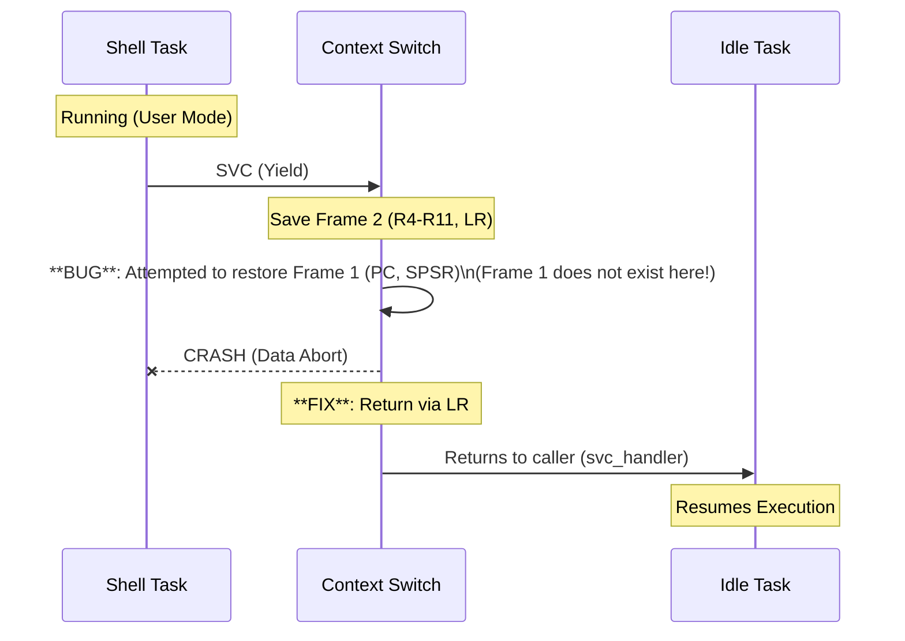
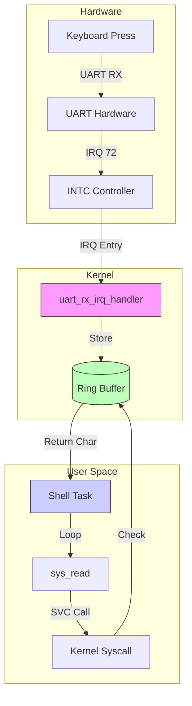

# Shell Debugging Report

## 1. Context Switch Crash (Data Abort)

### Issue Description
The system crashed with a **Data Abort** exception immediately after the Shell task yielded back to the Idle task.
- **Symptoms**: `PC` corrupted (pointing to data), `CPSR` invalid.
- **Root Cause**: The `context_switch` function in `context_switch.S` was attempting to restore **Frame 1** (SPSR, R0-R12, PC) from the stack. However, **Frame 1** only exists on the initial stack setup for new tasks. For a running task that voluntary yields, only **Frame 2** (Callee-saved registers + LR) is saved.
- **Result**: The restore instruction popped garbage data into PC and CPSR.

### Fix
Removed the code block in `context_switch.S` that attempted to restore Frame 1. The context switch now simply returns to the caller (`bx lr`) after restoring callee-saved registers (Frame 2).

### Diagram: Context Switch Stack Handling

---

## 2. Shell Input Failure & Lag

### Issue Description
1.  **Input Failure**: Coding in the shell did not work. `sys_read` always returned 0.
    - **Root Cause**: The UART RX interrupt was never enabled. The function `uart_enable_rx_interrupt()` existed but was not called in `kernel_main`.
    - **Fix**: Added `uart_enable_rx_interrupt()` call in `main.c`.
2.  **Input Lag**: Typing characters caused system unresponsive behavior and lost keys.
    - **Root Cause**: The `svc_handler` contained a debug `printf` inside the SVC dispatch loop. Since the shell calls `sys_read` (SVC #3) in a tight non-blocking loop, this caused thousands of print calls per second, saturating the UART output buffer and blocking the CPU.
    - **Fix**: Removed/Silenced debug logs in `svc_handler.c`, `uart.c`, and scheduler.

### Diagram: Corrected Input Flow

